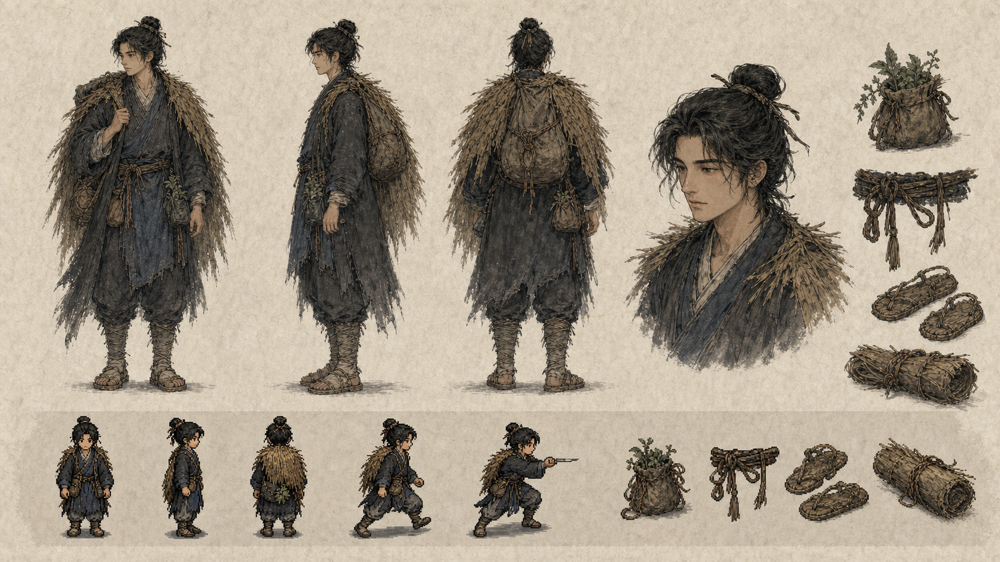
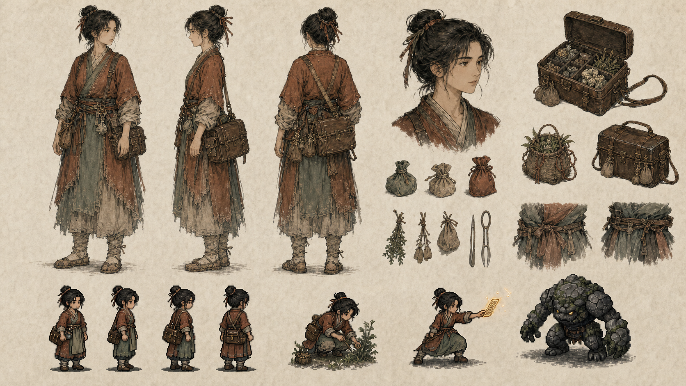
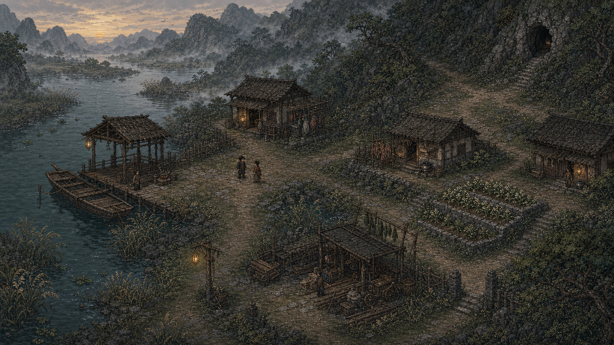
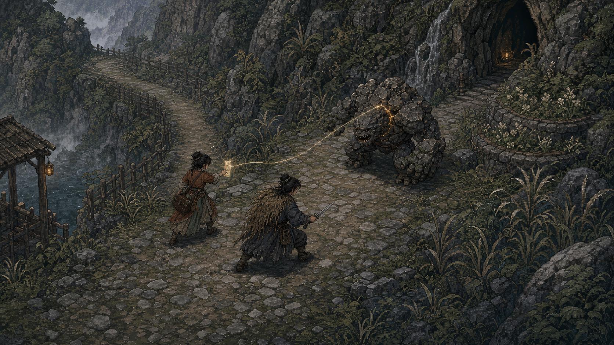
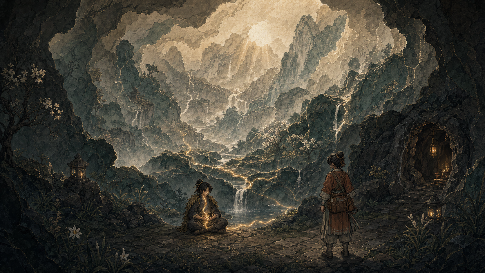

# 《山河有契》美术方向 · 第二轮生产基线

状态：视觉方向已确认，图像是概念基线，不是可直接切图的正式游戏资产

执行合同：[美术方向合同 v0.1](../../design/ART_DIRECTION_v0.1.md)

这一轮把第一轮的选择落实到同一组角色和连续场景：B 的手绘像素承担常规
探索与战斗，A 的纸本工笔承担人物设计与叙事情绪，C 只在突破、梦境和重大
秘境显现时进入画面。五张图共享主角、砚青、照禾县与藏泉的识别结构。

## 主角生产标准板

- 低重心、半髻、旧蓑衣和采药袋组成稳定轮廓；
- 炭黑与褪靛从纸本立绘延续到像素形态；
- 当前图用于锁定结构和身份，不用于直接裁切角色帧。

## 砚青生产标准板

- 赭红、草青、束袖和皮药箱是主要识别点；
- 采药、符纸与分类工具体现药师职责，不依赖首饰或宫装；
- 右下岩甲兽仅作体量参照，不是最终敌人表。

## 照禾渡口 · 常规探索地图

河岸、渡船、民居、工场、月芽田和藏泉入口形成可读的行动分区。该图验证
俯视三分之四像素地图的空间语法；正式地图需重新建立网格、TileSet、碰撞、
寻路和交互层。

## 藏泉山道 · 常规战斗

玩家、砚青、岩甲兽、符纸、甲片弱点和后撤空间在一个游戏镜头内保持可辨。
柔金只标记一次关键灵力关系，没有使用全屏辉光替代受击反馈。

## 藏泉突破 · 特殊叠景

像素前景向纸雕山河过渡，但人物仍保持凡人尺度。此语言仅用于境界转折等少数
时刻；普通洞窟不会因此维护另一套 2.5D 生产管线。

## 本轮检查结论

- 主角的蓑衣、采药袋、半髻和靛青结构跨媒介一致；
- 砚青的药箱、束袖、赭红与草青结构跨媒介一致；
- 探索图的道路、功能区与出口具有可转译为可玩地图的层级；
- 战斗图保留敌我间距、弱点、同伴动作和撤退路线；
- C 层画面明显特殊，但没有破坏克制、凡俗、危险的世界气质。

## 下一步生产验证

1. 用 48、56、64 px 三档角色高度做实际移动与碰撞可读性测试；
2. 重绘主角和砚青的网格化待机、行走、采集与战斗 Sprite Sheet；
3. 把照禾渡口拆成正式 TileSet、碰撞层、遮挡层与交互标记；
4. 制作一张带真实中文 UI 的探索画面和一张战斗画面；
5. 单独为岩甲兽建立结构、动作和受击反馈表。

生成过程、提示词和使用边界见 [PROMPTS.md](PROMPTS.md) 与
[资产来源记录](../../ASSET_PROVENANCE.md)。
