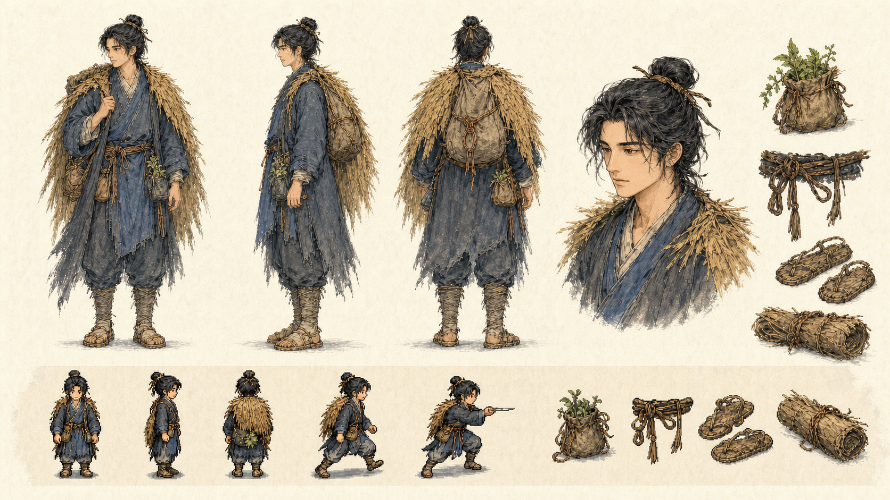
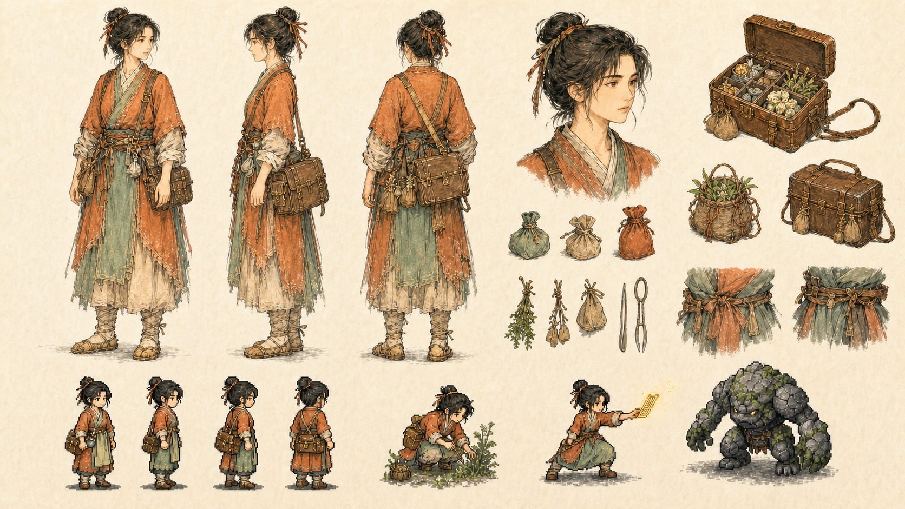
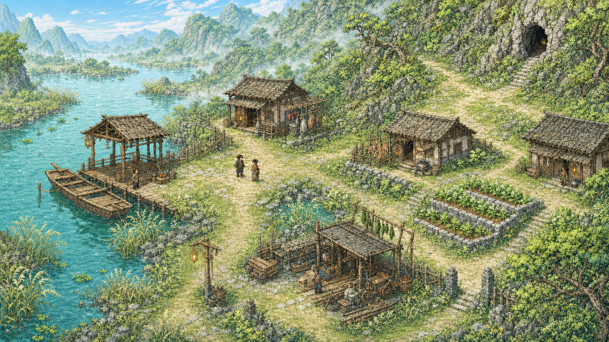
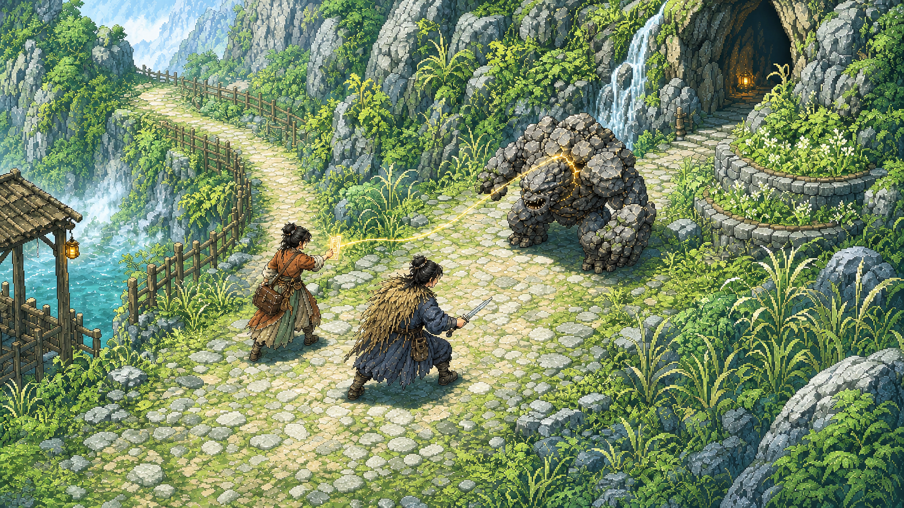
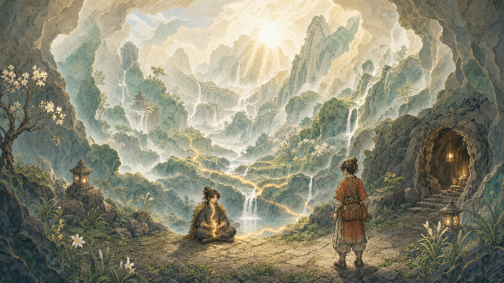

# 《山河有契》美术方向 · v2 明亮基线

状态：当前情绪与色彩基线；概念参考，不是可直接切图的正式游戏资产

执行合同：[美术方向合同 v0.2](../../design/ART_DIRECTION_v0.2.md)

本轮只调整光照、色阶、空气与人物情绪，保留 v1 的角色身份、服装结构、像素
比例、地图几何、战斗站位和三层媒介分工。目标是“清透、有生活气、愿意探索”，
而不是高饱和、幼态或没有危险。

## 主角 · 暖纸与晴靛

暖纸底和晴靛提高了亲近感，蓑衣、药袋、半髻及动作轮廓保持不变。

## 砚青 · 暖赭与新青

赭红和草青进入阳光下的矿物色区间，药箱、束袖、工具和人物身份没有重设计。

## 照禾渡口 · 雨后春日上午

水光、菜畦、芦苇和晾晒建立烟火气；道路、码头、房屋、药田和藏泉入口保持
可拆分的玩法层级。

## 藏泉山道 · 阳光下的危险

画面从阴郁遭遇转为清晨冒险，但岩甲兽重量、甲片弱点、符纸关系、敌我距离与
后撤空间仍然清楚。

## 藏泉突破 · 雨后新生

暖纸晨光与河玉远山建立希望感；洞穴冷框、渺小人物和单一灵金关系仍让它保持
特殊、克制，而不是变成常规观光地图。

## 视觉检查结论

- 两名角色的脸型、发髻、肩线、装备与像素轮廓跨版本一致；
- 渡口功能分区和通行路线没有被高亮植被吞没；
- 战斗图仍能快速识别敌我、弱点、攻击关系与退路；
- 突破图明显比常规地图特殊，但不再依赖大面积黑色营造庄严；
- 正式像素资产需进一步收敛局部绿色饱和度，并在 Godot 实机验证对比度。

生成提示词见 [PROMPTS.md](PROMPTS.md)，上一版暗调基线保留在
[art-direction-v1](../art-direction-v1/README.md) 供对照和回退。
