# 《山河有契》Godot 功能性美术灰盒 v1

状态：可运行、可复现的像素角色与 TileMapLayer 样章基线；仍需正式美术精修

这一轮把[明亮美术方向 v0.2](../../design/ART_DIRECTION_v0.2.md)落实到 Godot
1152×648 实际游戏画面。48×27、1536×864 的渡口与山道由整数像素镜头四边夹紧；
世界角色、敌人、地标与细节共同滚动，HUD 与模态阅读层保持屏幕固定。主角、砚青、梁叔、蕙婶、陶小满、四类敌人、渡口与山道地表已经接入项目原创、确定性
生成的像素图集。渡口和山道还共享一层原创芦苇、岸草、碎石、野花、石裂、苔痕、
落叶与水沫细节；三栋房屋、树木、码头、巨石、洞口、山门与三处生活设施也已接入十一
区地标图集，
只剩交互残痕、仪轨和战斗反馈等状态效果由项目代码即时绘制。没有把
生成概念图切入游戏，也没有使用外部图片、字体或插件。

使用以下命令重新生成全部截图：

```sh
make capture-rpg-ui
```

## 角色比例


同一轮廓分别置于亮草地、浅石路和冷影。48 px 的地图余量最好但身份信息不足；
64 px 识别最强但会压缩道路与碰撞空间；56 px 已接入 32×56 帧的四方向
`AnimatedSprite2D`、固定脚底锚点与小于视觉轮廓的碰撞盒，仍需在美术精修和
镜头缩放接入后复核。

## 照禾渡口


启动先进入中文标题界面，本地存在合法版本化存档时才允许继续；键盘、鼠标和
手柄共享焦点与确认动作，存档异常会保留原文件并显示原因。原创程序化环境音
默认关闭，环境音开关、三级音量、战斗表现速度和动态简化选项在标题与暂停界面
保持同步并保存到本机。模态层级被测试锁定，角色精灵与战斗反馈不会穿过纸面按钮。

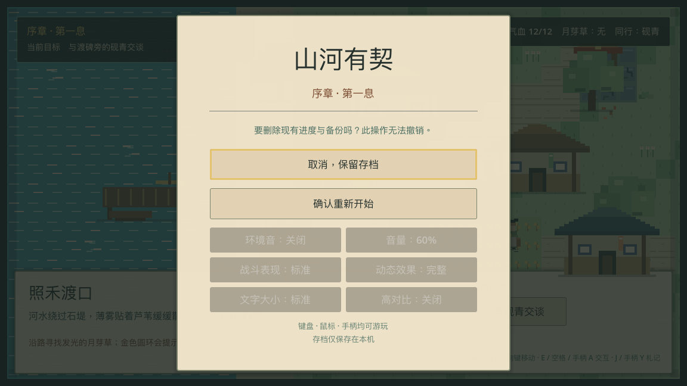

只要本机存在有效、异常、备份或中断写入的旅程文件，第一次选择重新开始都不会
删除任何字节。标题改为不可撤销警告，“取消，保留存档”默认获得键盘/手柄焦点，
无关偏好暂时禁用；只有再次选择“确认重新开始”才建立新旅程。Escape 与手柄 Start
也会取消，避免误触把可恢复进度变成不可恢复的数据损失。


地图占据主画面，章节与状态缩到上方，地点叙事和行动收在底部暖纸面板。镜头跟随
主角在扩展渡口中逐段呈现河岸、道路、房屋与药田；固定 HUD 不随世界位移。稀疏的芦苇、水沫、
路石和野花来自透明像素图块，只在地图类型变化时重建，不拥有碰撞或导航。主角可在河岸
自由移动；河水、建筑和边界会阻挡移动，砚青、药田与山门只在靠近时显示行动。
开场简报完成后砚青才开始跟随，抬头任务依次引导交谈、采药与进山。

补船木架与晾晒竹架把渡舟维护、药材翻晒和洗布等日常劳动留在同一张地图里。两处
都能反复靠近查看；键盘、鼠标和手柄进入同一行动路径，但不发物品、数值、札记或
结算回声，也不改变 Journey 快照；当前 save v16 不为这些重复观察增加字段。


简报完成后，砚青不再固定吸附在主角一侧，而是沿主角已经走过的归一化脚印保持
短距离同行。转弯时她先走到旧脚印再转向，不会斜切房屋；最多保留 96 点，换图与
读档在新位置近旁重建。主角仍是碰撞与交互的唯一权威，同行轨迹只负责动画、站位
和脚底深度排序。


石堤内侧的三层水痕是可选环境目标，不是任务箭头。靠近后可“辨认旧水痕”，了解
照禾人曾在涨水前转移药苗；调查会写入当前 save v16、改变石面余留并隐藏一次性行动，
但不提供战斗数值，避免把阅读变成必做的隐性强化。


地图按钮、`J` 和手柄 Y 打开同一张纸面札记。它同时回显当前目标和 `见闻 n/3`，
已读条目显示内容驱动标题与摘要，未读条目只留“未记之事”空位，不泄露位置或名称。
纸面接管焦点并阻断背后移动、交互与战斗输入，关闭后回到原来的操作上下文。


房屋与整棵树现在从同一张原创像素地标图集裁取，并复用独立前景节点。主角脚底在物体基部上方时，身体会自然进入遮挡；
走到基部下方时则显示在前景之上。渡口、山道和战斗各自重建所需节点，泉室清空
上一地图前景；全部地图深度都被限制在对话、标题和暂停纸面之下。节点数量仍为
渡口 7、山道 5、战斗 4，没有为贴图额外套一层子节点。


靠近月芽田后，同一地点同时给出“依旧规取一株”和“剪叶留根”两个真实行动按钮。
单键交互保持旧规默认路径，玩家也可以用鼠标或行动按钮明确选择留根方式；两个
动作都经过同一 domain、自动存档与进山门槛，而不是界面层的装饰选项。


剪叶后成熟叶消失，短茎与新芽留在田里，事件文字和章节结算都回显选择。save v9
保存采集方法，旧存档按已有持药/完成状态保守迁移为原来的整株记录。

## 同伴对话


底部暖纸对话层保留地图和人物站位作为情境。七句简报支持逐字显示、立即显示
整句、跳到回应与最近四句回顾；砚青使用暖赭衣色、草叶簪和较松的行旅药师轮廓，
与地图小人保持识别关系。每次推进都会保存，退出并继续后仍回到同一句；两项回应只改变
同行态度与章节结算回声，不会锁死主线。

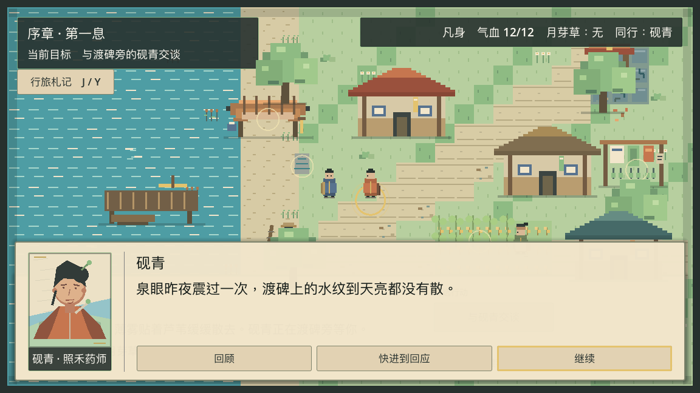

settings v3 的“文字大小：大字”把全部叙事阅读文本在场景基准字号上放大 1.25 倍，
“高对比：开启”按明度把每个阅读标签推向不透明的深墨或纸白锚点。两项设置在标题
与暂停界面同步、保存到本机，并且只作用于表现层，不改变规则、存档或战斗节奏。


说话人切换为玩家时，头像同步换为晴靛衣色、高束发和护符细节，正文画幅与按钮
不跳动。六种头像都是项目代码确定性绘制的明亮纸绘首轮占位，不是从概念图裁切的
正式资产；它们不进入存档，也不决定任何对话或旅程规则。


回顾模式不把某一位角色误当成多句历史的说话人，而改用纸页、笔和新青印记组成
的行旅札记。身份文字始终保留，头像忽略鼠标输入并且完全无动画，因此完整动态与
简化动态玩家获得相同的内容和焦点路径。

## 渡口巡路支线

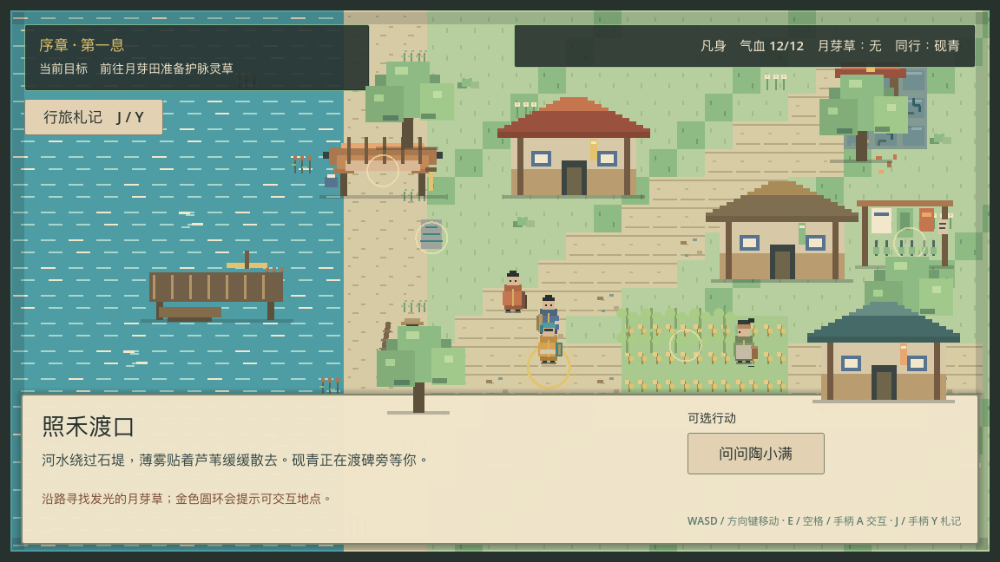

砚青简报完成后，陶小满才从中央石路出现。她使用第五张 32×56 四方向人物图集，
沿六个公开可走路点往返补船木架与晾晒竹架；玩家进入礼让范围时她会停步，离开
迟滞范围后继续。路线、停留与礼让由可保存的 `PatrolState` 驱动，地图精灵只负责
动画和脚底深度。两个路线端点停在目的地交互半径之外；道路若与其他固定目标重叠，
未回应且正在礼让的陶小满暂时优先，完成一次对话或她离开后固定行动立即恢复，
不会让停步中的人物永久失去对话入口。

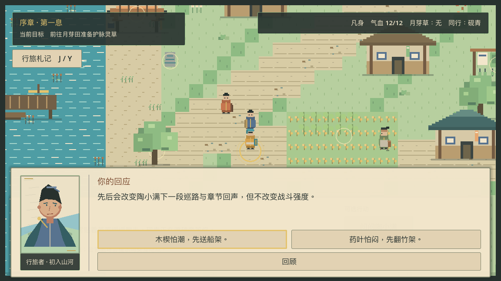

四句原创生活对话让玩家判断先送怕潮的补船木楔，还是先翻怕闷的药叶。两个按钮
都可由鼠标、键盘和手柄选择；选择以 staged transaction 同时提交 Journey 回应与
下一段巡路方向，再写入存档。save v15 首次引入路线状态；当前 save v16 继续保存。
它只改变路线、札记、章节结算与余波，不改变战斗、资源、修为或主线。截图中的
“你的回应”保持玩家头像，明确决定由玩家作出。

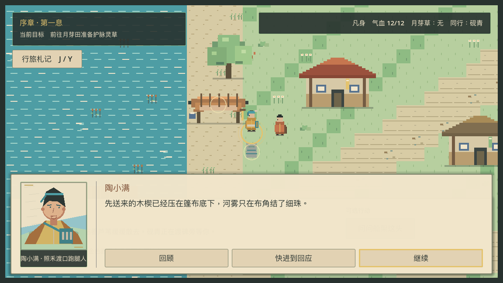

只有陶小满准确停在船架端点、仍有停留时间且玩家靠近时，“问问船架这头”才出现。
先送木楔与翻药后再送各有两句原创回响；玩家可选择压稳篷布或核对尺痕，两项都只
产生当下劳动的事件文字，不发奖励、关系值、札记、结算回声或主线门槛。

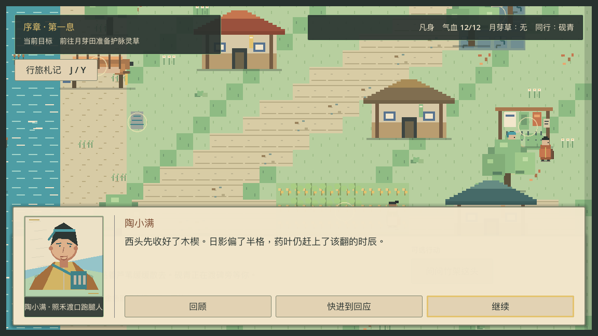

竹架同样按“先翻药”或“送船后再翻”显示不同回响，并让玩家扶稳竹匾或查看叶背
日影。玩家提前守候时，陶小满先完成到站而不会被礼让停在端点外；对话冻结巡路，
回应结束会立即把当前停留归零，但保留已有礼让状态；玩家仍近时她继续礼让，离开
迟滞范围后才恢复巡路。四段活动对话由 save v16 逐句恢复；版本
只扩展合法对话 ID，没有增加旅程字段，v1–v15 保守迁移，旧运行时以未来版本阻挡。

## 渡口守堤支线

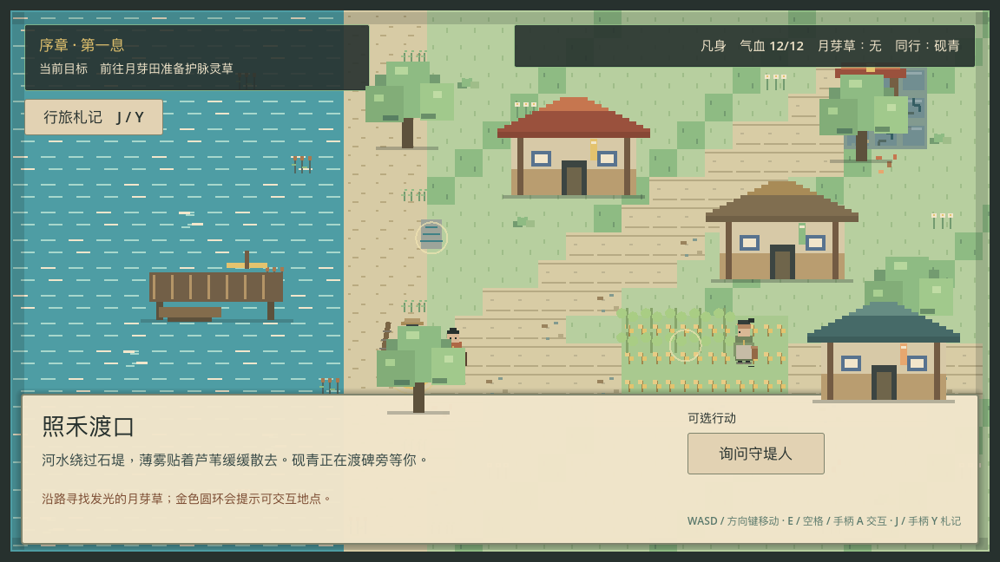

梁叔是渡口第三位独立动画角色，使用项目内生成的 32×56 四方向图集。玩家必须走到
下游浅石旁才会看到“询问守堤人”；歪斜水尺和量水杖与人物同屏，选择来自空间而非
远程任务菜单。

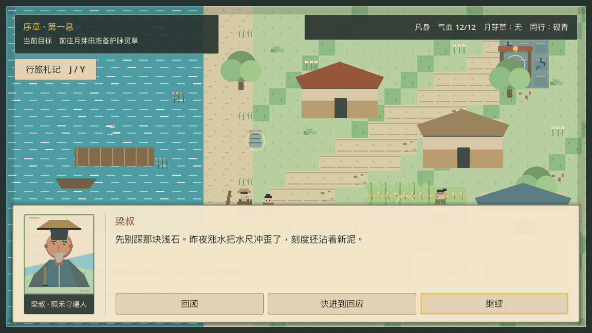

斗笠、灰须、雨披和量水杖把守堤人身份延续到纸绘头像。四句原创对话说明昨夜涨水
留下的新泥，最后让玩家在“扶正水尺”与“记录退水时刻”之间选择；提示明确两者都不
改变战斗强度，跳过、键盘、鼠标和手柄走同一结构化回应路径。

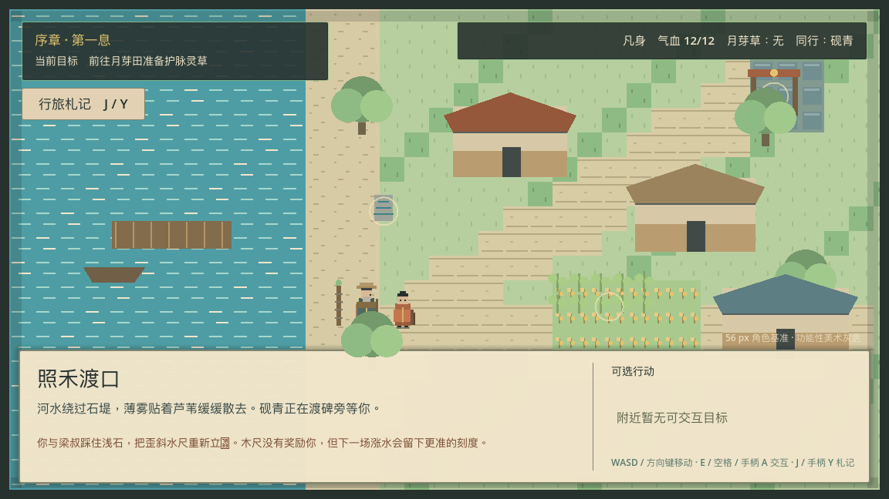

扶尺后木尺变为直立并出现新青标记，交互环与行动消失；记时分支则保留倾斜木尺并
系上纸签。save v11 引入二选一结果，当前 save v16 继续保存，并把它写进札记、章节结算和余波对白，但不发放
资源、战斗加成或隐藏关系数值。

## 渡口公用药篓支线

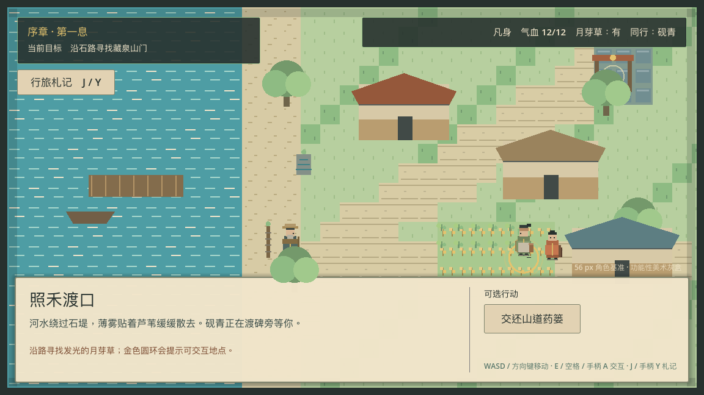

调查山道弃置药篓的双叶公用印后，返回渡口药圃才会出现“交还山道药篓”。蕙婶是
第四位独立地图角色，使用项目内确定性生成的 32×56 四方向图集；未发现药篓或已经
安置完成时，交互环与行动都会隐藏。

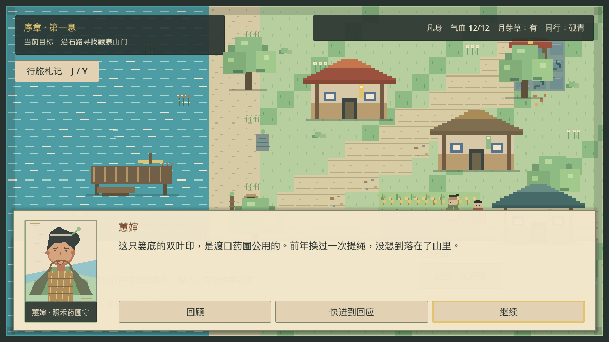

头巾、低髻、草叶簪与编织围裙把药圃守身份延续到第五种纸绘头像。四句原创对话把
选择限定为“补绳归圃”或“补绳留在山道避雨石下”，提示明确两者都服务后来人且不
改变战斗强度。逐句位置和当前对话标识可以随场景销毁后继续恢复。

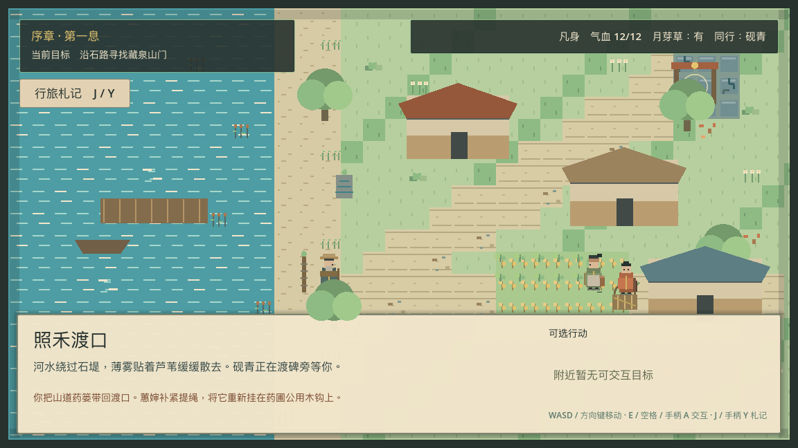

归圃分支把补好的药篓挂回蕙婶身旁，留山分支则在山道原处显示新绳结；两者都会
隐藏一次性交互并进入札记、章节结算与余波对白，不修改气血、符箓、石灯、援护、
见闻数或路线。save v12 保存 `return`/`trail`，v1–v11 保守迁移为未回应。

## 藏泉山道探索


地点、战斗、泉室和章节结算切换时，短促纸墨卡片先说明目的地，再渐隐显露新地图。
0.48 秒内鼠标、键盘和手柄焦点由转场层接管，避免玩家把确认键误送到新行动；简化
动态偏好则完全跳过渐隐。转场层位于所有地图遮挡之上、对话和菜单之下，中文文案
来自同一份经过结构校验的原创内容。


山门进入第二张可自由移动的地图。镜头沿溪流与连续石路逐段显露旧石标、洞口、
三类敌人和警戒圈；玩家可以选择岩甲幼兽、泉苔寄壳或失衡石傀，调查、沿溪上缘无战斗绕行或折返。山道地图与坐标可以中途保存，
在新的场景实例中恢复后仍落在同一地图，不会误用渡口碰撞。

石路旁的避雨石棚提供第三处同类空间叙事：干柴、水瓢与“取一束，后来补一束”的
旧规说明山道如何照应后来人。它与渡口两处生活设施一样可重复、无奖励，并通过三种
真实输入和公开移动路线验证。


山道新增石缝泉纹与弃置药篓两处生活线索。泉纹说明旧药圃曾被人维护，药篓保留
修补提绳与让物给后来人的痕迹；两者和渡口水痕组成 `见闻 n/3`，可分别发现、保存、
恢复并在结算回显。图中的金圈只说明当前可交互距离，读过后不会重复占用行动。

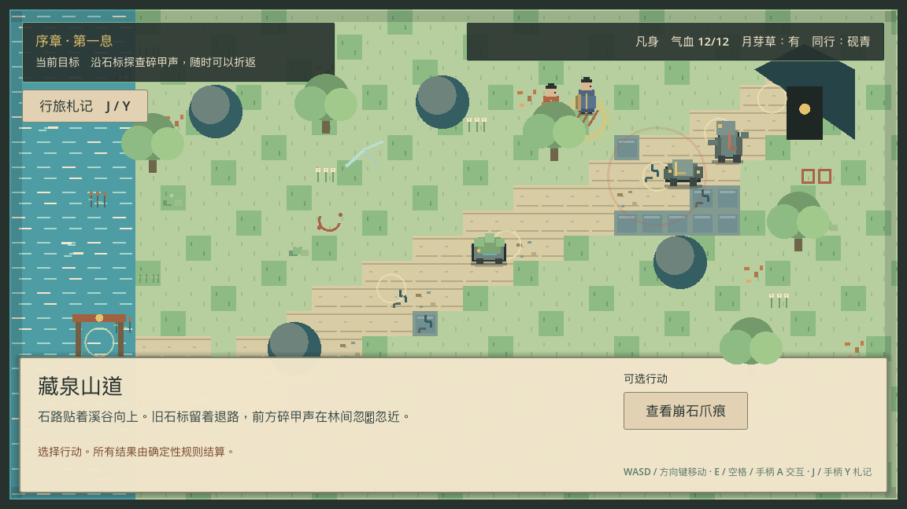

岩甲擦痕、泉苔孢痕与石傀拖痕直接绘在山道地表，不增加场景节点，也不依赖颜色
单独传意。远处以不同轮廓提示可疑之处，进入交互范围后才出现醒目的金色圆环；
调查后保留带识读印记的余痕，行动本身只写入情报，不修改气血、资源或路线。

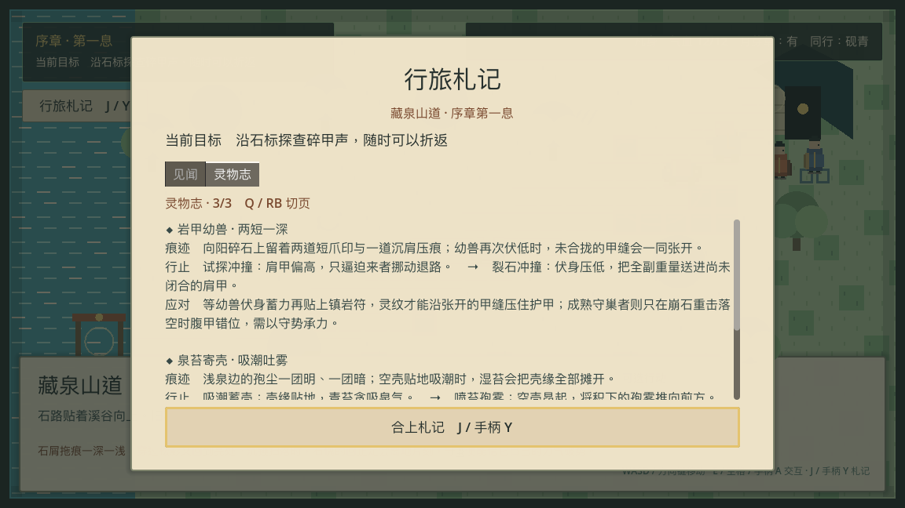

行旅札记原位提供“见闻 / 灵物志”两个可选择页签。未辨条目不显示敌名、招式、
地点或应对方法；已辨条目记录痕迹、两势循环与精确反制时机。鼠标可点页签，Q 与
手柄 RB 可切页，长内容在大字模式下可用键盘与手柄滚动，纸面仍阻断背后操作。

## 藏泉山道战斗


岩甲兽、甲缝、符线、敌我站位、洞口和退路在明亮环境中保持可读；泉苔与石傀也
使用独立的 64×64 双帧像素轮廓。危险不依赖黑暗滤镜，状态栏显示确定性战斗需要的气血、
敌血、符箓、同伴援护、石灯槽与回合。抬头目标始终显示当前敌势与伤害；只有亲自
调查过对应敌迹后，才会额外显示后一势与当前反制窗口。
引泉石灯在地图上显示青白核心和护阵光圈，持续效果不是只存在于文字里。


泉苔寄壳使用低矮湿苔轮廓，失衡石傀使用偏心站姿和拖地摆锤；两者与岩甲幼兽
共享按钮、状态栏、存档和战斗解析器，但下一招、伤害、生命上限与相克行动不同。
山道探索同时展示三类图集行，进入战斗后只保留当前稳定敌人标识对应的动画节点。


守巢者在普通敌人退场后沿用同一战斗布局，以更宽的甲片、腹部锈色弧线和三招
意图循环建立首领辨识。守住重击产生破甲，砚青援护产生凝息；只有存在的状态才
显示在状态栏，零层效果不会挤占 HUD。两种状态都能随 save v8 精确恢复。

战斗语义事件会在地图上短暂显示“石灯护阵”“识破弱点”“首领现身”等反馈。
同一事件批次还会让当前战斗敌人选择攻击或受击双帧：破绽、术式与符箓命中优先
显示受击，敌方命中或被化开的回应显示攻击。普通敌人退场、首领入场、胜利、撤退
与救援会回到已同步档案的待机帧，避免新首领替旧敌人受击。标准模式保留 0.70 秒
脉冲与姿态，快速模式缩短为 0.18 秒；简化动态改为静态文字和语义首帧。表现
偏好不阻塞输入，也不参与规则结算，同一行动在两种模式下的完整快照必须一致。

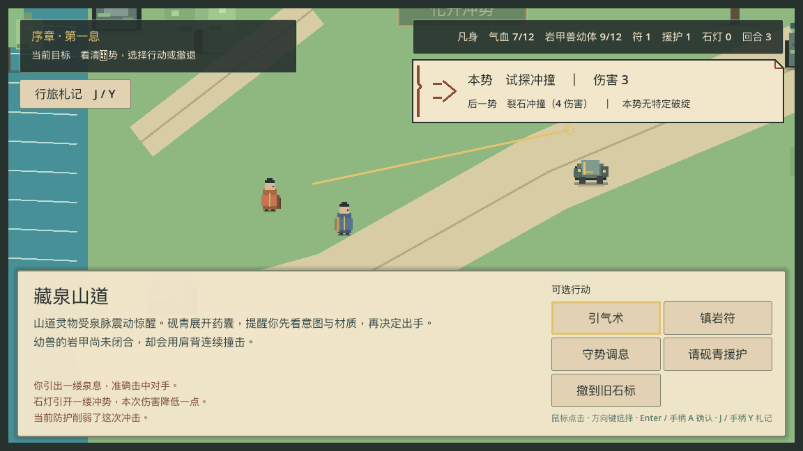

## 藏泉石室


山道之后进入第三张微地图 `cangquan_spring`。泉眼、月芽石床和静坐息石是三个
始终可见、必须亲自接近的空间目标，底部仍沿用同一套中文行动路径。domain 把突破
锁定为“听泉辨脉 → 月芽温脉 → 静坐引息”；乱序或重复交互会原子拒绝，不改变快照、
物品、存档或地图位置，界面只显示可恢复的中文顺序提示；只有温脉步骤消耗月芽草。

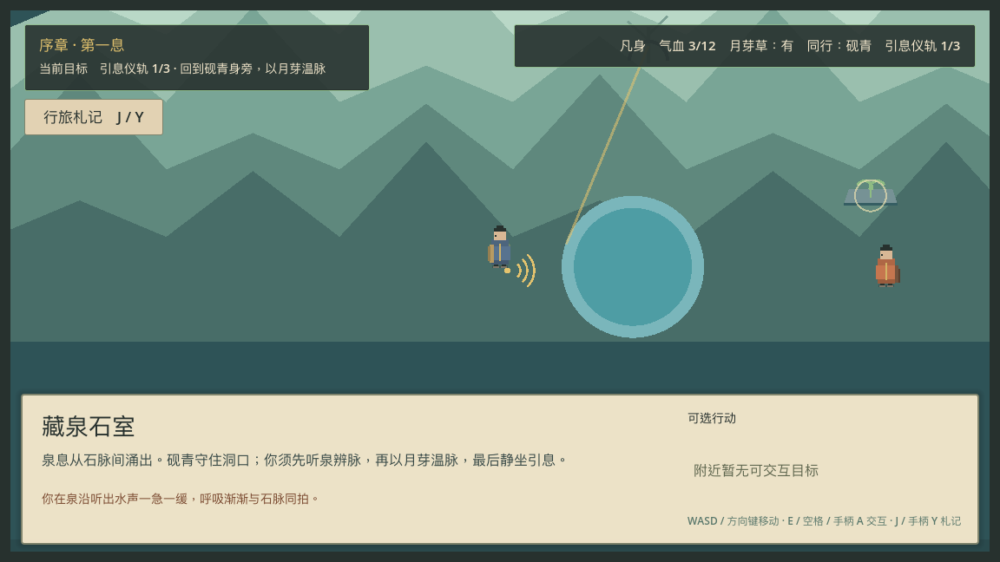

听泉完成后，泉纹沿石室亮起并把当前阶段写入 save v16。每次成功步骤都立即自动
保存稳定阶段和归一化坐标；返回标题、销毁场景或重新实例化后，玩家仍落在同一
位置与同一仪轨阶段，不会跳过动作或重复消耗资源。

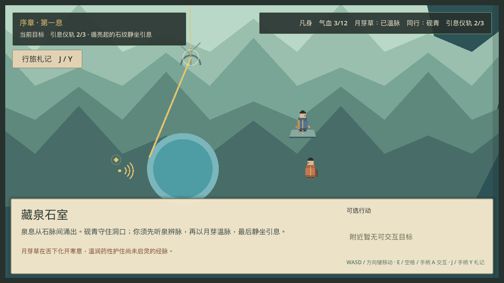

温脉完成后，月芽叶光从石床延伸到息石，第三个目标才成为 domain 允许的下一步；
三个目标本身并未从空间中消失，因此顺序不是靠隐藏按钮伪造。完成后重游章节会
清空 `first_breath_stage`，返回序章起点重新经历整条路径。

## 第一息


雨后暖光替代黑暗神迹，角色仍保持凡人尺度。章节结算没有增加第二套 UI 或改变
操作语义。结算明确显示境界、撤退/救援次数、符箓消耗与同伴状态，并允许回顾、
返回标题或重置后重游序章。


“回顾此行”现在进入五句可恢复对话。图中首句按这一轮实际路线写出“剪叶留根”
与“3 处见闻”；另一条 E2E 路线会改为整株采药、较少见闻、撤退次数和不同同行
回应。逐句中断仍由 save v16 恢复，两个收束选择只留下原创事件回声，不发隐藏奖励。

## 验证结论

- 56 px 是经过首轮移动与碰撞验证的角色高度工作基准，不是最终美术锁定；
- `WASD`/方向键、`E`/空格、鼠标行动和手柄 A 汇入同一语义输入路径；
- 渡口、山道探索、战斗、石室和完成态具有不同构图，规则状态仍完全来自 domain 层；
- 月芽采集的两个按钮、田地余留、存档恢复和结算回声来自同一稳定选择；
- 守堤支线的两项选择分别留下可见证据、札记和余波，但不制造隐藏最优数值路线；
- 陶小满的六点路线、礼让停步、两项送件先后、四段端点回响与精确恢复来自同一确定性巡路状态；
- 48×27、1536×864 的地图由整数像素镜头裁入 1152×648 窗口内的 1128×624 地图框，世界角色与地标共同滚动，HUD 与模态层固定；
- 中文地点、事件、目标、状态和行动在 1152×648 下完整显示；
- 八张项目图集在两个临时目录重建后逐字节相等并匹配 Git；十一个地标区域均为 RGBA8、透明边界且含可见像素；
- 四类敌人的待机、攻击与受击双帧按固定事件优先级切换，终局换档安全回待机，且不拥有规则、输入、时序或存档权威；
- 补船木架、晾晒竹架与避雨石棚可由键盘、鼠标和手柄反复查看，不改变 Journey 快照或 save v16；
- 山道返程山门由固定 7×7 石桥接回道路，出生点、退路和全部交互锚点不再落在水面；
- 静态场景为 112 节点、峰值 122，巡路态为 120，三种石室仪轨状态均为 113、完成态为 115，场景销毁后零泄漏；
- 捕获脚本只在写图时固定动画帧、反馈相位与转场时点，连续两轮 39 张 PNG 的聚合 SHA-256 均为 `427d2448c3ad1f5d2eeefbdfa00b874a86126f7759d78ba875cbdf54138093b6`；
- 下一步是对话速度偏好、纸绘头像精修、更密集的 NPC 日程和更长的原创支线内容。
