# 《山河有契》Godot 功能性美术灰盒 v1

状态：可运行、可复现的像素角色与 TileMapLayer 样章基线；仍需正式美术精修

这一轮把[明亮美术方向 v0.2](../../design/ART_DIRECTION_v0.2.md)落实到 Godot
1152×648 实际游戏画面。主角、砚青、四类敌人、渡口与山道地表已经接入项目原创、确定性
生成的像素图集；建筑、树木与效果仍由项目代码绘制为功能性前景。没有把
生成概念图切入游戏，也没有使用外部图片、字体或插件。

使用以下命令重新生成全部截图：

```sh
make capture-rpg-ui
```

## 角色比例

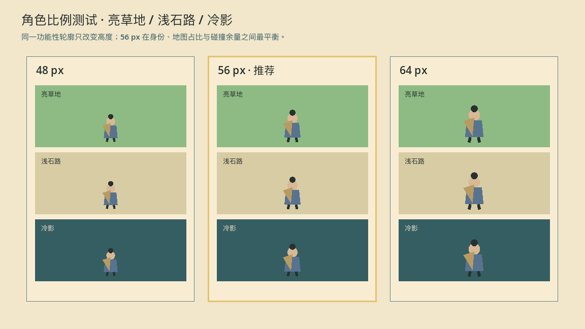

同一轮廓分别置于亮草地、浅石路和冷影。48 px 的地图余量最好但身份信息不足；
64 px 识别最强但会压缩道路与碰撞空间；56 px 已接入 32×56 帧的四方向
`AnimatedSprite2D`、固定脚底锚点与小于视觉轮廓的碰撞盒，仍需在美术精修和
镜头缩放接入后复核。

## 照禾渡口

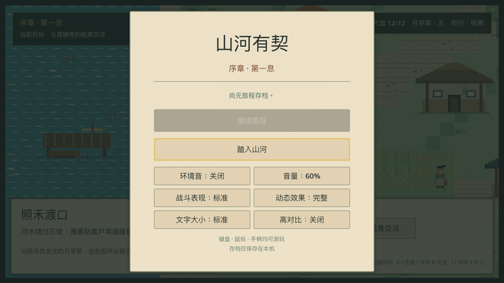

启动先进入中文标题界面，本地存在合法版本化存档时才允许继续；键盘、鼠标和
手柄共享焦点与确认动作，存档异常会保留原文件并显示原因。原创程序化环境音
默认关闭，环境音开关、三级音量、战斗表现速度和动态简化选项在标题与暂停界面
保持同步并保存到本机。模态层级被测试锁定，角色精灵与战斗反馈不会穿过纸面按钮。

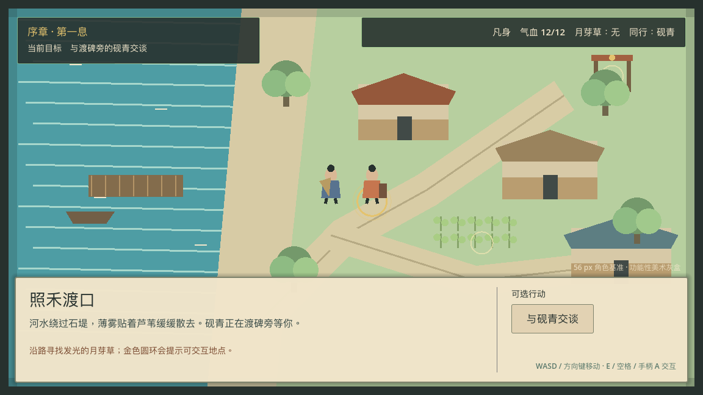

地图占据主画面，章节与状态缩到上方，地点叙事和行动收在底部暖纸面板。渡口、
河岸、道路、房屋、药田、主角和砚青可以在一个镜头中辨认。主角现在可在河岸
自由移动；河水、建筑和边界会阻挡移动，砚青、药田与山门只在靠近时显示行动。
开场简报完成后砚青才开始跟随，抬头任务依次引导交谈、采药与进山。


简报完成后，砚青不再固定吸附在主角一侧，而是沿主角已经走过的归一化脚印保持
短距离同行。转弯时她先走到旧脚印再转向，不会斜切房屋；最多保留 96 点，换图与
读档在新位置近旁重建。主角仍是碰撞与交互的唯一权威，同行轨迹只负责动画、站位
和脚底深度排序。

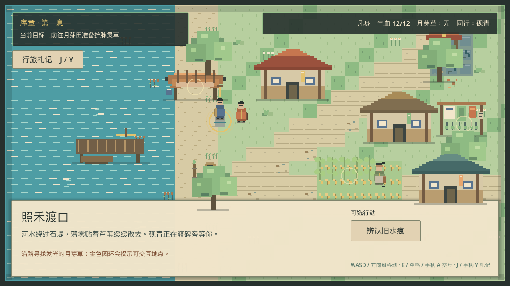

石堤内侧的三层水痕是可选环境目标，不是任务箭头。靠近后可“辨认旧水痕”，了解
照禾人曾在涨水前转移药苗；调查会写入 save v10、改变石面余留并隐藏一次性行动，
但不提供战斗数值，避免把阅读变成必做的隐性强化。

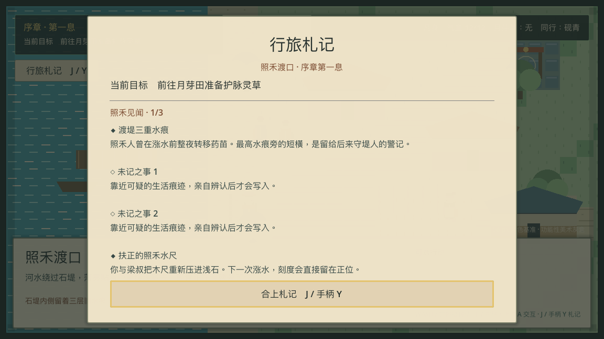

地图按钮、`J` 和手柄 Y 打开同一张纸面札记。它同时回显当前目标和 `见闻 n/3`，
已读条目显示内容驱动标题与摘要，未读条目只留“未记之事”空位，不泄露位置或名称。
纸面接管焦点并阻断背后移动、交互与战斗输入，关闭后回到原来的操作上下文。

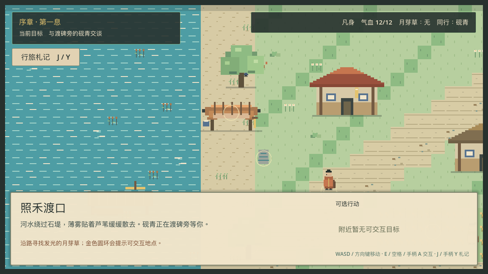

树冠与屋檐现在是独立前景节点。主角脚底在物体基部上方时，身体会自然进入遮挡；
走到基部下方时则显示在前景之上。渡口、山道和战斗各自重建所需节点，泉室清空
上一地图前景；全部地图深度都被限制在对话、标题和暂停纸面之下。

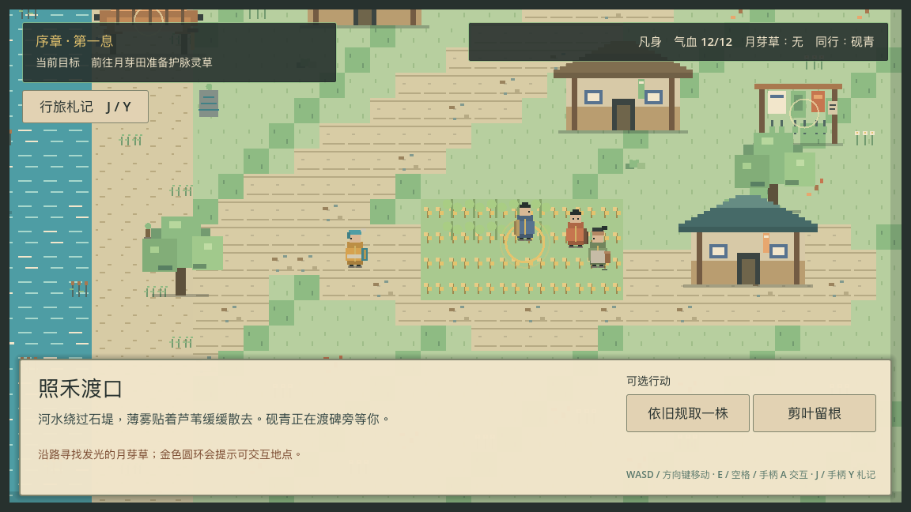

靠近月芽田后，同一地点同时给出“依旧规取一株”和“剪叶留根”两个真实行动按钮。
单键交互保持旧规默认路径，玩家也可以用鼠标或行动按钮明确选择留根方式；两个
动作都经过同一 domain、自动存档与进山门槛，而不是界面层的装饰选项。

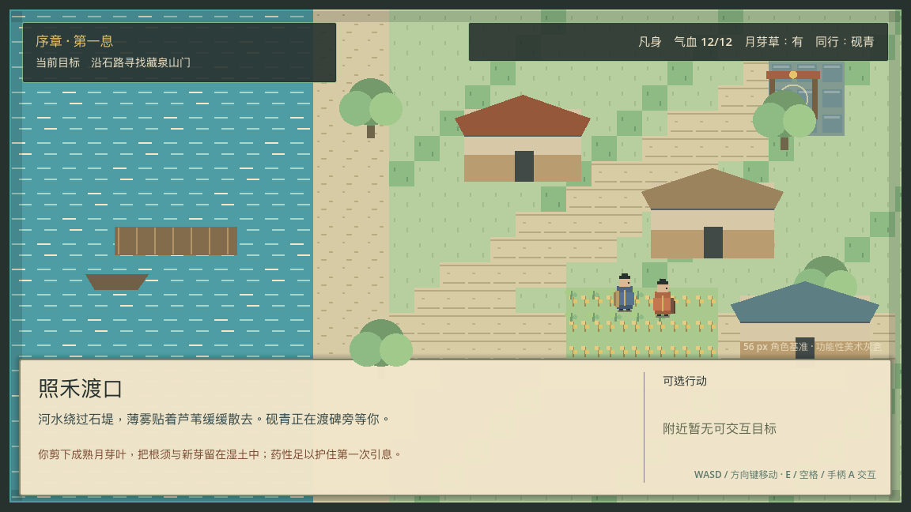

剪叶后成熟叶消失，短茎与新芽留在田里，事件文字和章节结算都回显选择。save v9
保存采集方法，旧存档按已有持药/完成状态保守迁移为原来的整株记录。

## 同伴对话

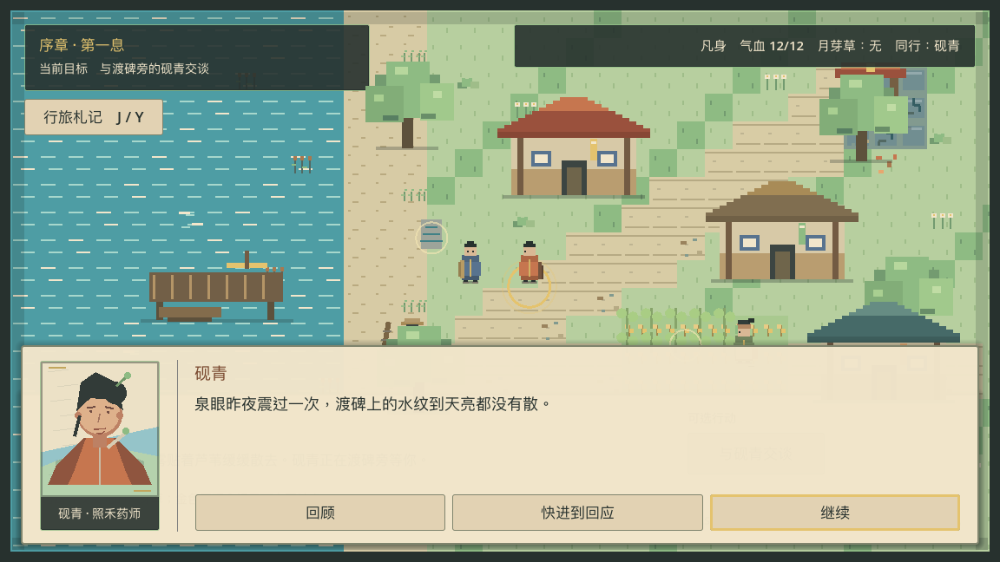

底部暖纸对话层保留地图和人物站位作为情境。七句简报支持逐字显示、立即显示
整句、跳到回应与最近四句回顾；砚青使用暖赭衣色、草叶簪和较松的行旅药师轮廓，
与地图小人保持识别关系。每次推进都会保存，退出并继续后仍回到同一句；两项回应只改变
同行态度与章节结算回声，不会锁死主线。

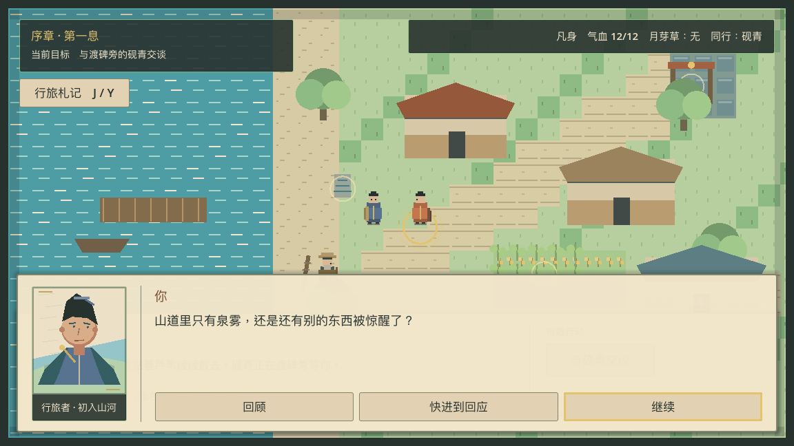

说话人切换为玩家时，头像同步换为晴靛衣色、高束发和护符细节，正文画幅与按钮
不跳动。三种头像都是项目代码确定性绘制的明亮纸绘首轮占位，不是从概念图裁切的
正式资产；它们不进入存档，也不决定任何对话或旅程规则。

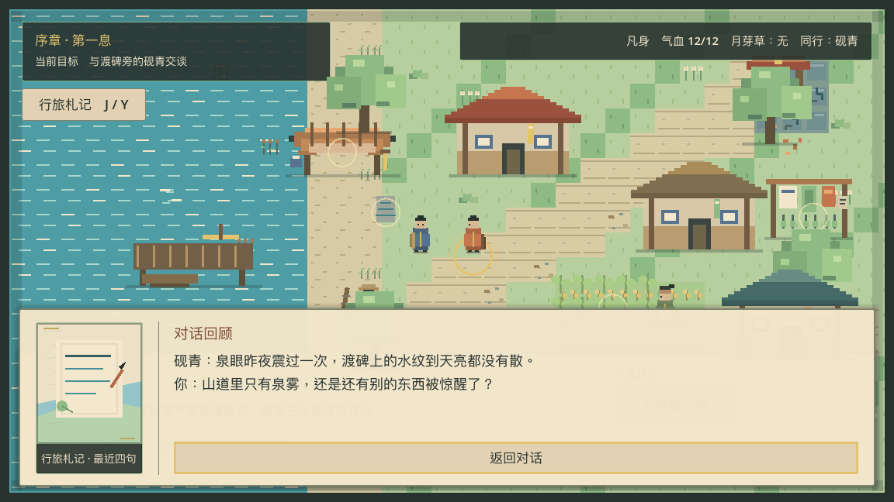

回顾模式不把某一位角色误当成多句历史的说话人，而改用纸页、笔和新青印记组成
的行旅札记。身份文字始终保留，头像忽略鼠标输入并且完全无动画，因此完整动态与
简化动态玩家获得相同的内容和焦点路径。

## 藏泉山道探索

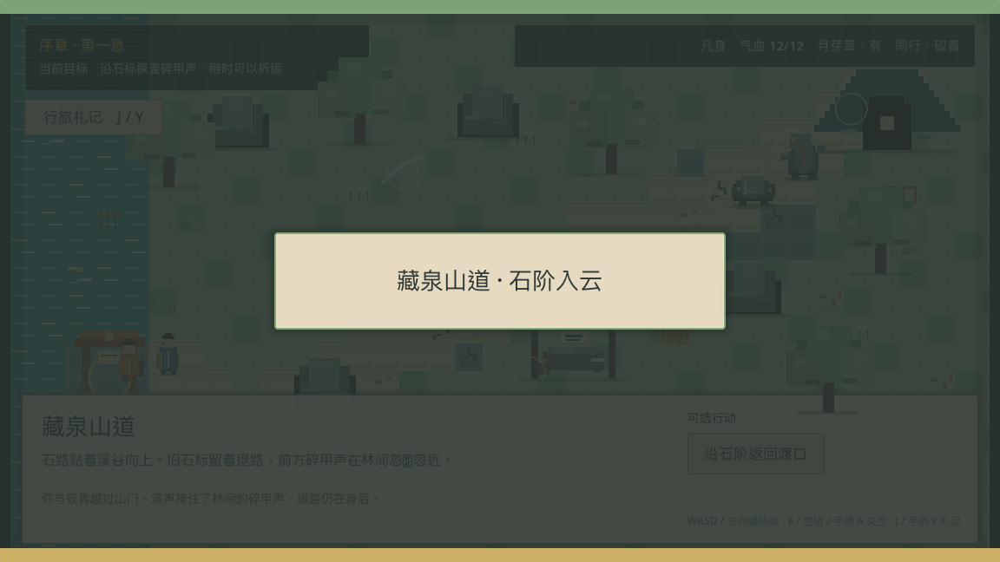

地点、战斗、泉室和章节结算切换时，短促纸墨卡片先说明目的地，再渐隐显露新地图。
0.48 秒内鼠标、键盘和手柄焦点由转场层接管，避免玩家把确认键误送到新行动；简化
动态偏好则完全跳过渐隐。转场层位于所有地图遮挡之上、对话和菜单之下，中文文案
来自同一份经过结构校验的原创内容。

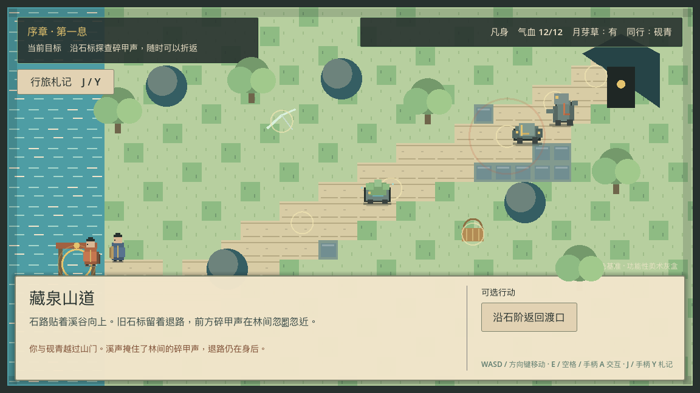

山门进入第二张可自由移动的地图。溪流、连续石路、旧石标、洞口、三类敌人和警戒圈
在同一镜头中可读；玩家可以选择岩甲幼兽、泉苔寄壳或失衡石傀，调查、沿溪上缘无战斗绕行或折返。山道地图与坐标可以中途保存，
在新的场景实例中恢复后仍落在同一地图，不会误用渡口碰撞。

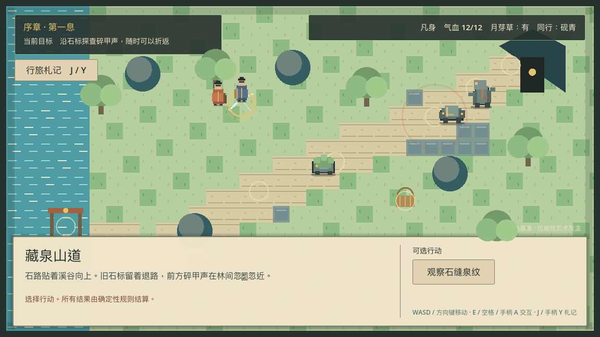

山道新增石缝泉纹与弃置药篓两处生活线索。泉纹说明旧药圃曾被人维护，药篓保留
修补提绳与让物给后来人的痕迹；两者和渡口水痕组成 `见闻 n/3`，可分别发现、保存、
恢复并在结算回显。图中的金圈只说明当前可交互距离，读过后不会重复占用行动。

## 藏泉山道战斗

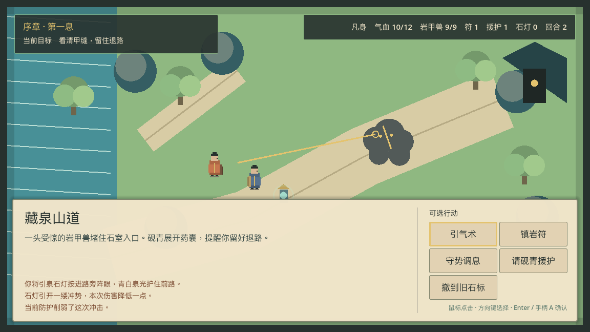

岩甲兽、甲缝、符线、敌我站位、洞口和退路在明亮环境中保持可读；泉苔与石傀也
使用独立的 64×64 双帧像素轮廓。危险不依赖黑暗滤镜，状态栏显示确定性战斗需要的气血、
敌血、符箓、同伴援护、石灯槽与回合，抬头目标会提前显示下一招、伤害与材质弱点。
引泉石灯在地图上显示青白核心和护阵光圈，持续效果不是只存在于文字里。

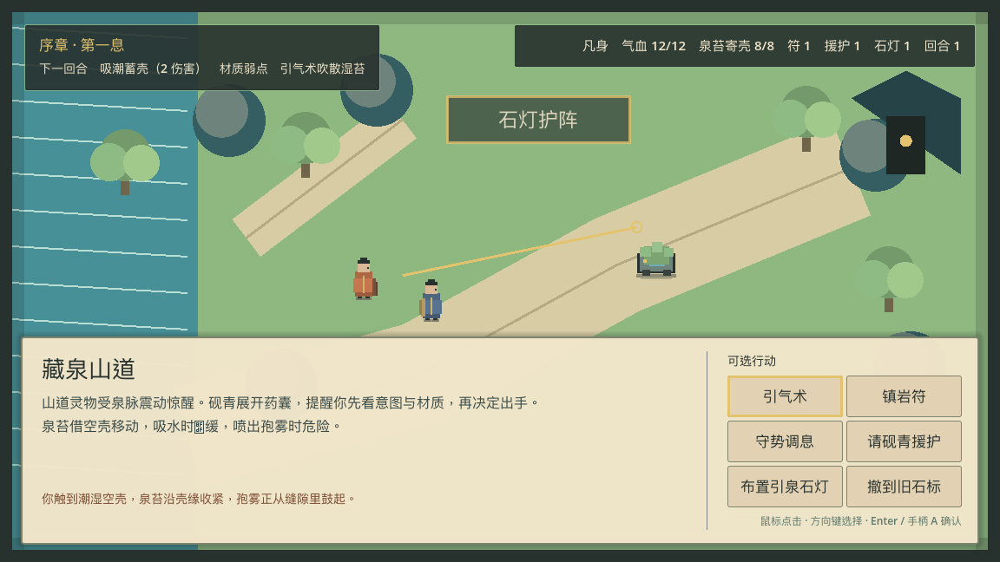

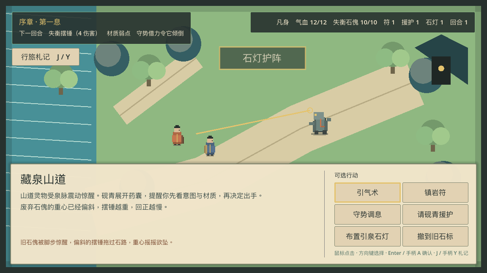

泉苔寄壳使用低矮湿苔轮廓，失衡石傀使用偏心站姿和拖地摆锤；两者与岩甲幼兽
共享按钮、状态栏、存档和战斗解析器，但下一招、伤害、生命上限与相克行动不同。
山道探索同时展示三类图集行，进入战斗后只保留当前稳定敌人标识对应的动画节点。

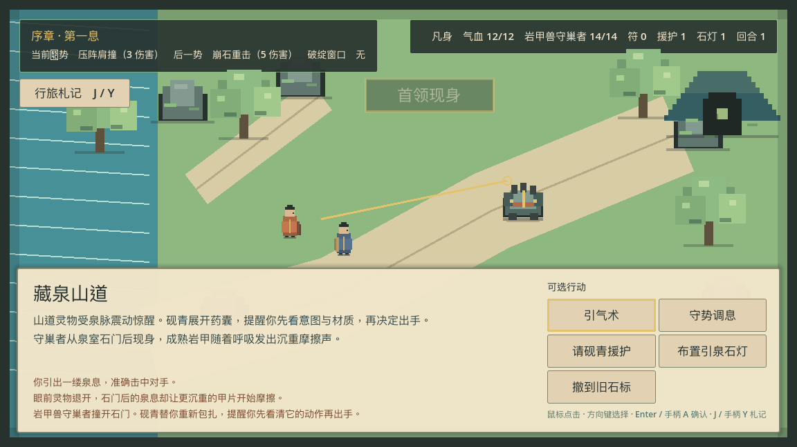

守巢者在普通敌人退场后沿用同一战斗布局，以更宽的甲片、腹部锈色弧线和三招
意图循环建立首领辨识。守住重击产生破甲，砚青援护产生凝息；只有存在的状态才
显示在状态栏，零层效果不会挤占 HUD。两种状态都能随 save v8 精确恢复。

战斗语义事件会在地图上短暂显示“石灯护阵”“识破弱点”“首领现身”等反馈。
标准模式保留 0.70 秒脉冲，快速模式缩短为 0.18 秒；简化动态改为静态显示。表现
偏好不阻塞输入，也不参与规则结算，同一行动在两种模式下的完整快照必须一致。

## 藏泉石室

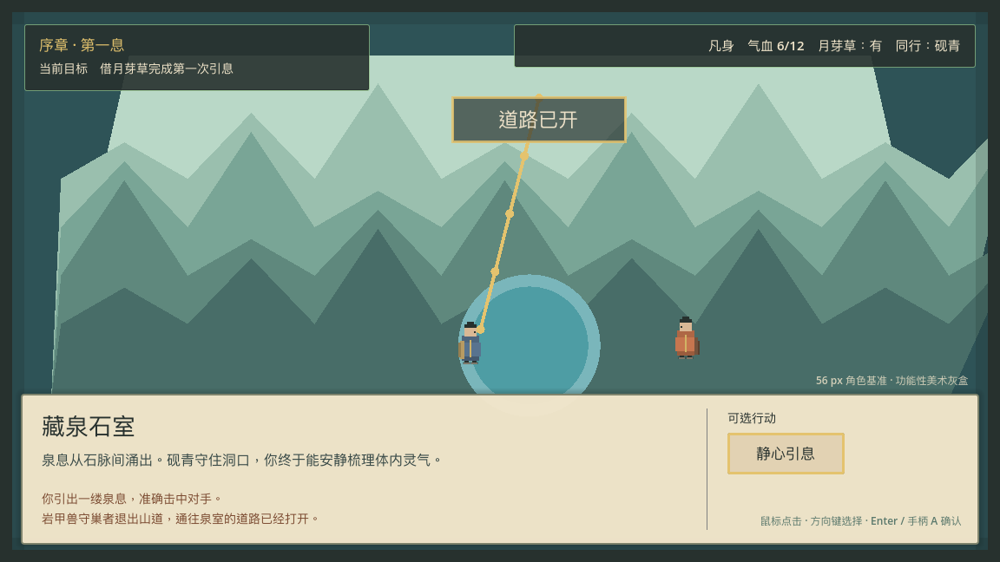

常规地图转入冷影洞室与分层山河，单一灵金关系引向突破目标，底部仍沿用同一套
中文行动路径。

## 第一息

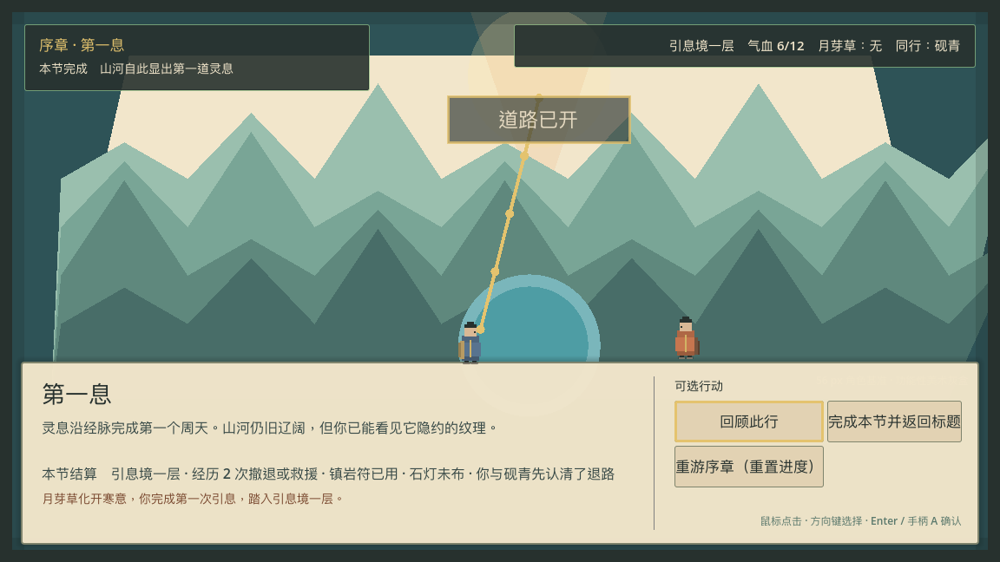

雨后暖光替代黑暗神迹，角色仍保持凡人尺度。章节结算没有增加第二套 UI 或改变
操作语义。结算明确显示境界、撤退/救援次数、符箓消耗与同伴状态，并允许回顾、
返回标题或重置后重游序章。

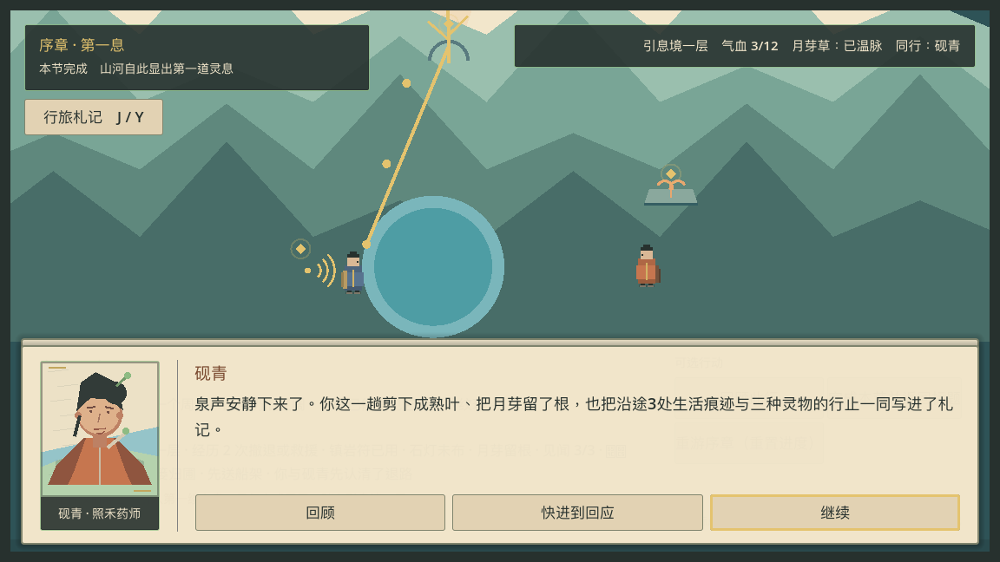

“回顾此行”现在进入五句可恢复对话。图中首句按这一轮实际路线写出“剪叶留根”
与“3 处见闻”；另一条 E2E 路线会改为整株采药、较少见闻、撤退次数和不同同行
回应。逐句中断仍由 save v10 恢复，两个收束选择只留下原创事件回声，不发隐藏奖励。

## 验证结论

- 56 px 是经过首轮移动与碰撞验证的角色高度工作基准，不是最终美术锁定；
- `WASD`/方向键、`E`/空格、鼠标行动和手柄 A 汇入同一语义输入路径；
- 渡口、山道探索、战斗、石室和完成态具有不同构图，规则状态仍完全来自 domain 层；
- 月芽采集的两个按钮、田地余留、存档恢复和结算回声来自同一稳定选择；
- 中文地点、事件、目标、状态和行动在 1152×648 下完整显示；
- 下一步是纸绘头像精修、环境前景图块、相机边界、独立巡逻 NPC 导航和更多有后果的支线内容。
