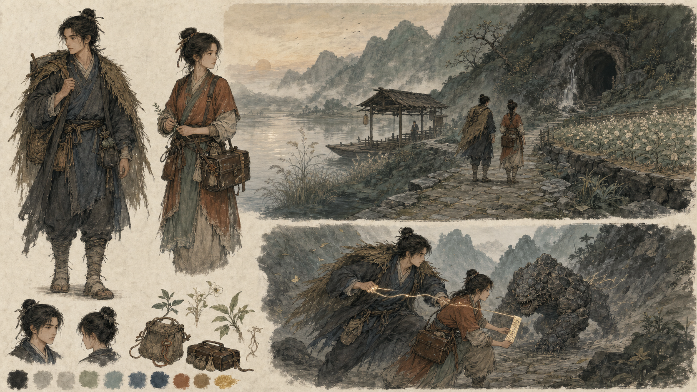
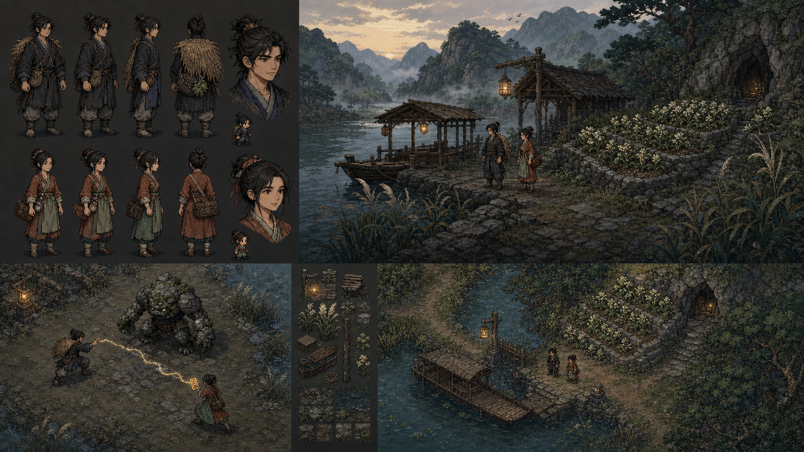
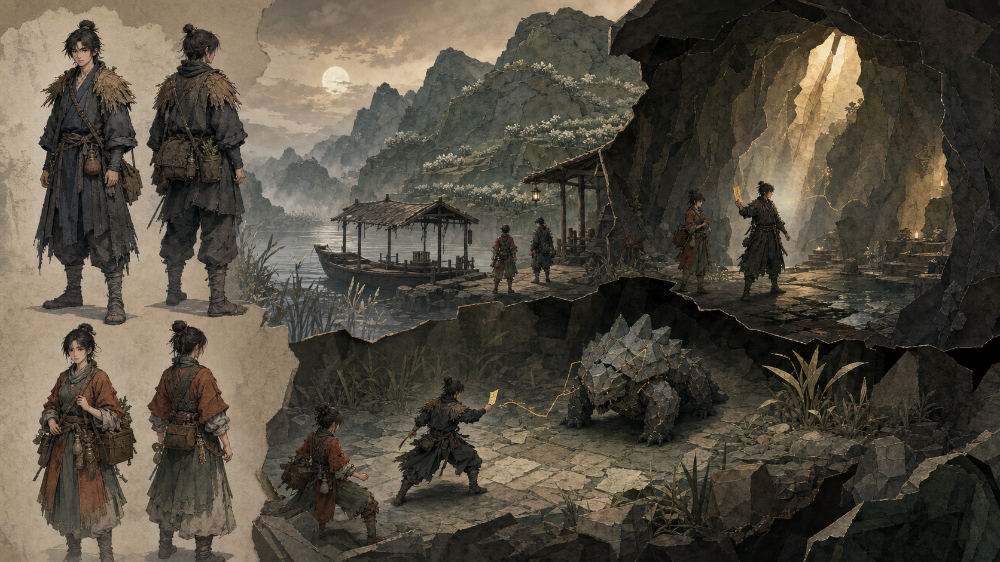

# 《山河有契》美术方向探索 · 第一轮

状态：方向已选择，图像仍不是正式游戏资产

选择结果：以 B 的地图与玩法生产为基线，融合 A 的立绘、纸张质感与色彩；
C 保留为突破、梦境和重大秘境的特殊场景语言。执行合同见
[美术方向合同 v0.1](../../design/ART_DIRECTION_v0.1.md)。

这一轮固定角色、地点、敌人与剧情动作，只改变生产媒介和视觉语言，避免把
“换内容”误认为“换风格”。所有画面均为项目原创设定的视觉探索。

## 固定内容

- 主角：年轻凡人行旅，炭黑麻衣、褪色靛青内层、旧蓑衣与采药袋；
- 篇章同伴砚青：年轻女药师，赭红与鼠尾草绿工装、皮药箱；
- 地点：照禾渡口、月芽田、藏泉山道与藏泉石室；
- 敌人：矮壮的岩甲兽；
- 灵力表现：细窄柔金气线与一张符纸，不使用大面积粒子爆炸。

主角性别、砚青外形与服装均为本轮探索假设，尚未成为角色设定。

## A · 纸上山河

工笔人物精度、矿物色和写意山水留白结合。它最能建立安静、凡俗、有人情的
原创世界，也最适合叙事插画和角色特写。风险是地图、动作帧和大量 NPC 的人工
成本高，必须先定义线稿与上色的可复用层级。

## B · 像素行旅

手绘像素簇、有限色盘、俯视三分之四地图和清晰战斗轮廓。它最接近可以投入
垂直切片生产的方案：地图、角色、怪物与交互热点的可读性最好，也最容易建立
可测试的 TileMap 管线。风险是必须避免常见复古模板感，并保持肖像与地图角色
之间的身份一致。

## C · 叠景秘境

纸雕层片、克制低模、水墨与矿物材质构成 2.5D 舞台。空间、洞窟、机关和秘境
的表现力最强，能够让地图真正承担叙事。风险是遮挡、镜头、灯光、材质和角色
动画形成更复杂的生产与性能管线。

## 初步比较

| 方向 | 原创辨识度 | 玩法可读性 | 小团队产能 | 技术风险 |
| --- | ---: | ---: | ---: | ---: |
| A · 纸上山河 | 5/5 | 3/5 | 2/5 | 2/5 |
| B · 像素行旅 | 4/5 | 5/5 | 5/5 | 1/5 |
| C · 叠景秘境 | 5/5 | 4/5 | 3/5 | 4/5 |

当前制作建议是以 B 作为垂直切片的可执行基线，同时评估把 A 的人物肖像、纸张
质感和克制色彩融入 B。C 适合在后续秘境章节作为特殊场景语言，但不应在没有
原型验证前直接成为全游戏管线。

## 共同禁区

- 不复制现有小说或游戏的人物、服装、法宝、场景或构图；
- 不使用宫装、悬浮长袍、巨型武器、泛二次元脸和无来源的奢华仙宫；
- 不使用霓虹仙气、全屏粒子和不可读的光效掩盖玩法；
- 不把概念图直接切割为正式素材；角色、地图和怪物仍需结构化设计。

完整生成提示词见 [PROMPTS.md](PROMPTS.md)。

## 选定方向后的下一轮

1. 主角与砚青的比例、正侧背三视图和表情表；
2. 照禾渡口昼夜环境关键帧与实际游戏镜头；
3. 岩甲兽结构拆解、动作轮廓与受击反馈；
4. 地表、建筑、植被、水体和灵气效果的材质规范；
5. 一张带真实 UI 的探索画面和一张完整战斗画面。
