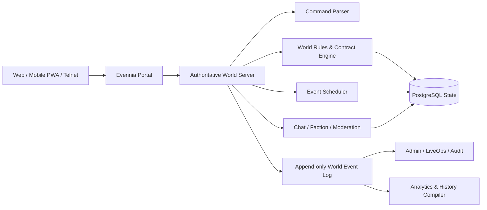

# 《山河有契》MUD 原创立项圣经 v0.1

日期：2026-07-31

定位：东方幻想、文字为主、多人在线、持续演化的世界

一句话：**向天地借一线权柄，以自己的名字偿还。**

> 这不是《凡人修仙传》的改编案，也不使用其人物、地名、法宝、功法、境界序列、情节或专有表达。它研究的是长篇修仙叙事的结构规律，再从零建立另一套世界规则。

## 1. 先说结论

项目建议定名为 **《山河有契》**，首个大版本可叫 **《山河有契：归潮》**。

它与常见修仙游戏最大的区别不是换一套境界名，而是把“力量”设计成一份可执行、可违约、会留下公共后果的契约：

- 每种能力都有对象、条件、代价、期限与见证者。
- 玩家越强，能够影响的不是更大的伤害数字，而是更大的规则范围。
- 城镇、商路、门派、气候、战争和 NPC 生计都与玩家的契约相连。
- 服务器会记住玩家造成的历史；下一季的地图、物价、阵营和任务由这些历史演化。
- 顶级成长必须经由合作、组织和公共信用完成，避免“单人小说主角复制进 MMO”的根本矛盾。

推荐用 **Evennia + Python + PostgreSQL + WebSocket/PWA** 做第一个可玩的版本。Evennia 已经提供账户、角色、房间、出口、命令、频道、权限和网页客户端等 MUD 基础模块，适合先验证世界与玩法，而不是从网络层重造一切。[Evennia API](https://www.evennia.com/docs/latest/Evennia-API.html)；[Portal/Server 架构](https://www.evennia.com/docs/latest/Components/Portal-And-Server.html)

## 2. 对用户提供文本的核验与研究边界

### 2.1 文件里实际有什么

本地文本约 21 MB、29.7 万行、UTF-8 编码。结构扫描得到：

- 正文共 11 卷，从“七玄门风云”到“真仙降世”；正文结束编号为第 2446 章。
- 文件出现 2451 个章标题，但只有 2443 个不同章号。
- 第 1747—1754 章在第十卷开头重复了一次。
- 第 1761、1834、1876 章的正文衔接存在，但章标题在这个版本中缺失。
- 末尾不是完整的《仙界篇》长篇，只包含两段“仙界篇”外传和一段“凡界篇”外传。

这说明文件适合做结构研究，但不是可以无条件信任的校勘本，更不能把封面处的宣传文字误读成内容真的包含两部完整长篇。

### 2.2 “完整阅读”在这里是什么意思

我已经完成的是：全文件结构扫描、卷章索引、章题统计、阶段抽样精读、关键机制归纳和文件异常核验。

我不会假装在一次上下文中逐字记住七百多万字。若要制作《原作叙事机制研究卷》，还应继续做分批语义通读：每 25—50 章一份无专名摘要，再把 2446 章合并成阶段图谱。该研究卷应与原创开发团队隔离，只输出抽象规律，不输出可复用表达。

## 3. 从长篇修仙叙事中应该提取什么

### 3.1 值得保留的结构规律

1. **资源不是奖励，而是剧情发动机。** 稀缺材料同时制造探索、交易、欺骗、组队、争夺和制作目标。
2. **地图就是难度。** 从村镇到宗门、边地、海域、异界，地理扩张让力量升级获得新的社会尺度，而不只是怪物换皮。
3. **信息差比战力差更耐玩。** 不知道某物价值、不知道路线危险、不知道对方底牌，才能让交易与侦察长期成立。
4. **组织不是简单善恶阵营。** 它们提供功法、保护、身份、市场和情报，也收取义务；玩家加入组织应当是一份交换。
5. **每次成长都改写风险结构。** 旧危险消失后，新的政治责任、资源成本、声望与敌人随之出现。
6. **长寿必须反映在社会上。** 时间跳跃、旧友老去、城市兴衰、传承断裂，才会让“修长生”不只是经验条。
7. **阶段结尾需要改变问题，而非只结束 Boss。** 从“如何活下来”变成“依附谁”，再变成“如何建立自己的秩序”。

### 3.2 必须主动舍弃的部分

- 单一主角拥有不可替代的成长外挂。
- 经典境界顺序的原样复制。
- 同名或近似的人物、地点、势力、法宝、灵兽、秘境与招式。
- “乡村少年—小门派—神秘师父—秘密宝物—试炼—大宗门”这一连串高度可识别的剧情组合。
- 以杀人夺宝作为经济系统的唯一高效解。
- 高阶玩家对低阶玩家毫无成本的碾压。
- 女角色只作为奖励、牵挂或修炼资源。
- 用不断开放“更高一界”掩盖旧世界失去意义。

## 4. 原创核心：天地不是能量池，而是一张欠账表

### 4.1 宇宙规则

世界由六种“律”彼此制衡而存在：

| 律 | 管辖 | 可产生的玩法 |
|---|---|---|
| 生息 | 生长、腐朽、繁殖、修复 | 医疗、农作、毒、生态恢复 |
| 形质 | 物性、重量、坚脆、转化 | 锻造、护甲、地形改变 |
| 行止 | 速度、方向、距离、阻滞 | 身法、运输、封锁、传送 |
| 名实 | 身份、伪装、所有权、誓言 | 社交、侦察、司法、盗窃 |
| 往复 | 记忆、痕迹、周期、预兆 | 追踪、考古、预测、回放 |
| 众愿 | 信任、恐惧、习俗、共同决意 | 阵营、城市、军队、公共工程 |

“修行”不是吸收一种通用能量，而是学习向某一条律借权。天地一定索取对价，区别只在于对价由谁、何时、以什么形式支付。

### 4.2 契式：所有技能共享的语法

每个能力都由五个必填项构成：

1. **对象**：能力对谁或什么生效。
2. **条件**：在什么状态下才可发动。
3. **代价**：体力、材料、记忆、信誉、感官、寿命或未来义务。
4. **期限**：一息、一次战斗、一季或永久。
5. **见证**：谁或什么能证明这份契约成立。

示例：一名行止系玩家可以把“缩短十步距离”写成不同契式。独行版需要消耗自己的方向感；队伍版由同伴作见证，代价是全队在三息内不能后退；城市版则需要道路碑和当地居民承认。相同概念因此能形成潜行、战斗、运输和公共建设四种玩法。

### 4.3 契债

力量不会只消耗“蓝条”。违背条件、让他人代付、在错误地域滥用能力都会形成契债：

- 轻债：命令失败、留下可追踪痕迹。
- 中债：暂时失去某种感官、技能变形、被对应律排斥。
- 重债：在世界生成“欠景”——一块会反复重演未偿后果的动态危险区域。

欠景既是失败反馈，也是全服内容生成器。其他玩家可以调查、利用或共同清偿它。

## 5. 修行阶梯

这套阶梯表达“规则权限”，不对应传统炼气、筑基、结丹等序列。

| 阶段 | 能力变化 | 游戏解锁 | 主要风险 |
|---|---|---|---|
| 听律 | 感知一条律的局部变化 | 侦察、采集、初级契式 | 误读现象 |
| 留痕 | 签下短暂、单对象契式 | 基础战斗与制作 | 代价失衡 |
| 结枢 | 建立个人稳定“律枢” | 技能组合、专精、收徒 | 枢被污染 |
| 展域 | 在有限范围改变规则 | 团队角色、领地事件 | 地域反噬 |
| 铸名 | 让身份成为规则的一部分 | 传承、复生、名号权能 | 名实冲突 |
| 司衡 | 调整多人契约与公共规则 | 山门治理、城战、裁决 | 公共债务 |
| 归律 | 把一项自创规则留给世界 | 赛季终局、角色传说化 | 角色退出一线 |

终局不是无限升数值。归律角色把自创能力、地标或制度写入服务器历史，随后转为传奇 NPC、祖师或世界规则；玩家在账户层获得“传承”，再以新角色进入世界。这样既保留长生感，也给新玩家留下生存空间。

## 6. 历史观：谁替繁荣支付了代价

### 6.1 年代表

| 时代 | 关键事件 | 留给现在的矛盾 |
|---|---|---|
| 无历时代 | 六律在荒野中自然平衡，人类只会口头盟誓 | 许多古老规则没有文字记录，只认仪式与行为 |
| 口盟纪 1—427 | 聚落以见证人和共同记忆维持契约 | 地域文化差异极大，外来法律常常失效 |
| 列城纪 428—1190 | 第一块“衡碑”出现，城市开始保存和执行契式 | 城市之间争夺解释权，形成不同法统 |
| 大簿纪 1191—1674 | 衡朝建成“万契总簿”，统一道路、度量、身份和远程契约 | 繁荣的代价被转嫁给边地、无名者和未来世代 |
| 断契之年 | 总簿在四十九日内崩解，距离、身份、季节和物性局部失常 | 旧帝国消失，账却没有消失；欠景遍布各地 |
| 余契纪 1—312 | 城邦、商盟和地方山门重建秩序 | 是否重建中央秩序成为当代最大争论 |

游戏从余契纪 312 年“归潮”开始。旧总簿碎片同时苏醒，各阵营都声称自己有办法修复世界，但每种方案都要求不同的人承担代价。

### 6.2 历史不是背景文本

- 城镇是否承认某种身份，取决于过去赛季的政治选择。
- 被玩家救下的村庄会成为商路节点；被放弃的村庄可能成为欠景。
- 每件高阶契器记录制造者、历任持有者、重大事件和违约史。
- 官方年鉴只记录“被制度承认的历史”，民间口述可能与它冲突。
- 玩家可以成为史官、伪造者、考据者、证人或被抹去的人。

## 7. 世界地图

### 7.1 五大区域

| 区域 | 自然与社会 | 主要玩法 | 核心冲突 |
|---|---|---|---|
| 中衡盆地 | 旧都废墟、密集城邦、残存衡碑 | 政治、司法、贸易、考古 | 要不要重建总簿 |
| 东镜海 | 岛链随潮汐改变距离，港口彼此竞争 | 航海、物流、走私、海战 | 谁拥有航路的“距离” |
| 南烬岭 | 断契时物性失控，山脉仍缓慢熔融 | 锻造、采矿、灾害治理 | 工业繁荣与环境契债 |
| 西眠漠 | 风暴会吹出他人的记忆和旧时代片段 | 探索、情报、身份谜题 | 记忆能否成为商品 |
| 北无昼原 | 日照以多年为周期迁徙，聚落追随温暖移动 | 生存、迁城、护送、生态 | 固守领地还是尊重迁徙 |

地图下方还有一张非物理网络“回声河”。所有欠景都在此相连，它不是传统副本大厅，而是服务器历史的伤口索引。

### 7.2 五个主要阵营

| 阵营 | 主张 | 给玩家的利益 | 它的问题 |
|---|---|---|---|
| 司契院 | 恢复统一标准与公共秩序 | 身份、司法、稳定技能 | 容易重演中央转嫁代价 |
| 还山盟 | 让契约回归地方生态与社区 | 地域能力、农林、庇护 | 排外且难以协作大工程 |
| 百炉行 | 一切代价都可定价和流通 | 制作、市场、物流 | 可能把人本身变成资产 |
| 无名渡 | 保护被总簿追索的人 | 隐匿、改名、救援 | 抹去身份也会抹去责任 |
| 旧账会 | 唤醒全部历史，逐笔清算 | 考古、往复律、禁术 | 真相可能摧毁仍在生活的人 |

所有阵营内部至少有三派，避免把选择做成颜色不同的善恶条。玩家山门可以与阵营结盟，但不能永久垄断全部内容。

## 8. 玩家体验框架

### 8.1 四层核心循环

**30 秒：**观察环境 → 读取条件 → 选择行动或契式 → 得到清晰反馈。

**30 分钟：**接受一个需求 → 调查信息 → 准备材料/同伴 → 解决事件 → 承担后果。

**一周：**经营关系、制造契器、运送资源、偿还契债、参与山门计划。

**一季（建议 10—12 周）：**全服围绕一个公共危机作选择，永久改变一部分世界。

### 8.2 角色创建

角色不抽“灵根”。创建时选择三项：

- **来处**：决定最初的社会关系和方言知识。
- **旧诺**：一个尚未完成的承诺，是个人剧情钩子。
- **不愿支付的代价**：定义角色底线，也限制某些强力组合。

外貌、性别、年龄和关系取向不绑定数值优势。账户可以拥有多个角色，但重大阵营投票按账户限制，防止小号操纵。

### 8.3 战斗

文字战斗采用低频服务器权威结算，而不是每秒刷十条伤害：

1. **察势**：发现对方条件、地形与未结代价。
2. **立意**：公开或隐藏本轮意图。
3. **成式**：投入资源并满足契式条件。
4. **应契**：队友或敌人进行见证、拆解、转嫁、承受。
5. **结算**：伤势、位置、契债、装备和环境同时变化。

建议世界行动 1 秒一拍，重要战斗 3—5 拍构成一轮。技能设计优先改变信息、位置、条件和代价，纯伤害技能不超过总量的三分之一。

### 8.4 受伤、死亡与传承

- 失败先产生伤势、失物、债务、俘虏或关系后果，不直接删号。
- 死亡后可由同伴招魂、由阵营赎回“真名”，或创建继承者。
- 继承者得到部分知识与关系，但不会完整继承战力。
- 高频自杀、送装备和死亡刷收益必须由同一套遗产规则封堵。

### 8.5 制作与经济

装备不是白绿蓝紫橙流水线，而是“材料性质 + 制作者契式 + 使用历史”的组合。

经济闭环：

`采集/物流 → 加工 → 契器/建筑/消耗品 → 使用与损耗 → 修复/拆解 → 材料回流`

关键约束：

- 没有无摩擦的全球拍卖行；价格与库存按地区存在。
- 商路会被天气、战争和玩家建设改变。
- 高阶物品有维护与见证成本，不能永久零成本囤积。
- 主要货币由城市信用支撑，战乱会影响汇率。
- 材料有广泛用途，避免只为一张配方服务。
- 回收、建筑维护、契债清偿和组织开支构成货币回收口。

### 8.6 任务与叙事

不用“NPC 永远站着等同一只狼牙”的任务模型。任务由三层组成：

- **需求**：NPC、社区、组织或生态系统缺什么。
- **事实**：世界数据库中已经发生什么。
- **提案**：玩家或系统提出怎样解决。

同一需求允许交易、战斗、伪造、谈判、迁徙或公共建设等解法。结果写入事件账本，并成为后续 NPC 行为、地图说明和史书条目的输入。

LLM 可以把结构化结果改写成不同 NPC 的语气，不能自行决定掉落、胜负、法律状态或永久历史。

## 9. 多人在线设计

### 9.1 为什么玩家必须彼此需要

- 高级契式需要不同类型的见证，不是“多人让血条掉得更快”。
- 地图信息会过期，侦察者与记录者能出售可靠情报。
- 运输、制造、司法、医疗和战斗都是完整职业路径。
- 山门规则由玩家制定：税率、开放时间、盟约、继承、战争窗口。
- 公共工程跨越数日或数周，贡献不仅是交材料，也包括设计、护送、谈判和维护。

### 9.2 防止老玩家统治服务器

- 高阶力量依赖地域、名望和维护，不能无条件投射到新手区。
- 新手的“未署名见证”对某些古契独有价值，使其不是廉价劳动力。
- 司衡以上进入声望与责任型成长，战力增幅明显放缓。
- 归律让老角色进入世界历史，账户保留身份荣誉而非永久碾压数值。
- 城战采用宣战窗口、目标上限和战后恢复期，禁止凌晨偷家。

### 9.3 PvP 原则

- 默认城镇内受司法保护，野外也有清晰风险提示。
- 玩家可选择和平、有限冲突或高风险契约状态。
- 抢劫所得受赃物标记、追索和销赃成本约束。
- 高等级杀低等级会产生极高名实债与组织后果。
- 任何付费都不出售战斗优势、契债豁免或司法免责。

## 10. 技术框架

### 10.1 推荐路线

**第一阶段：Evennia 模块化单体。**

- 服务端：Python、Evennia、Django。
- 实时连接：WebSocket；保留 Telnet 作为硬核客户端入口。
- 数据库：开发期 SQLite，测试/生产 PostgreSQL。
- 前端：React 或轻量 TypeScript PWA，移动端优先。
- 缓存/队列：先不用；出现真实负载后再引入 Redis 与任务队列。
- 部署：容器化单区域，自动备份、可恢复演练、滚动发布。

Evennia 的 Portal 处理 Telnet/WebSocket 等连接，Server 处理游戏逻辑；官方设计允许游戏 Server 重载时保持客户端连接，但 Portal 与 Server 预期运行在同一台机器，因此不要把它宣传成天然无限横向扩展。[Evennia Portal/Server](https://www.evennia.com/docs/latest/Components/Portal-And-Server.html)；[WebSocket 客户端](https://www.evennia.com/docs/latest/api/evennia.server.portal.webclient.html)

**第二阶段：按痛点拆分。**

- 身份、支付、公告等 Web 服务可先拆。
- 跨区聊天、推送和分析再单独服务化。
- 世界模拟按地理区域分区前，先做压测和事件热度分析。
- 若未来加入大量短时匹配副本、移动 SDK、好友/战队/排行榜，可评估 Nakama；它对服务端权威匹配和社交功能支持完善，但它不是持久世界 MUD 内容引擎，不应在 MVP 阶段同时引入两套核心框架。[Nakama 多人模型](https://heroiclabs.com/docs/nakama/concepts/multiplayer/)

### 10.2 逻辑架构



### 10.3 数据对象

| 对象 | 关键字段 |
|---|---|
| Account | 身份、权限、封禁、同意记录、年龄/地区策略 |
| Character | 来处、旧诺、真名状态、位置、伤势、传承 |
| LawAffinity | 六律熟练、可承受代价、地域修正 |
| Contract | 对象、条件、代价、期限、见证、违约规则、版本 |
| Debt | 来源、债权对象、严重度、偿还方式、扩散规则 |
| Place | 静态地理、动态状态、司法辖区、生态、出口 |
| Faction | 章程、成员、资产、盟约、公共债、治理权限 |
| Item | 材料、契式、耐久、所有权、来源与历任持有者 |
| LoreFact | 内容、来源、可信度、谁知道、是否过期 |
| WorldEvent | 类型、参与者、前后状态摘要、因果链、审计信息 |
| MarketOrder | 地区、货物、价格、履约与运输状态 |

不要一开始对整个系统做纯事件溯源。PostgreSQL 当前状态是权威；对永久世界变化、经济、管理操作和高价值物品额外写入只追加事件日志，并用事务 outbox 保证状态与事件一致。

### 10.4 契式内容格式

```yaml
id: xingzhi_fold_step_v1
display_name: 折步
law: 行止
target: self
condition:
  - shadow_touches_destination
cost:
  type: orientation_memory
  amount: 1
duration: instant
witness:
  type: ally_or_road_marker
effects:
  - move_to_visible_shadow
breach:
  - gain_debt: lost_direction
content_version: 1
```

规则与文案分离，便于测试、平衡、本地化和版权审查。所有永久结果必须由确定性规则产生。

### 10.5 最小命令集

`看`、`观察`、`听`、`查验`、`去`、`跟随`、`说`、`密语`、`交易`、`给予`、`记录`、`施契`、`应契`、`撤契`、`偿债`、`制作`、`修复`、`立约`、`举报`、`屏蔽`、`求助`。

中文自然语言可以映射到这些确定性命令，但必须在执行前显示解析结果；涉及交易、PvP、永久消耗和组织权限时二次确认。

### 10.6 可靠性与安全

- 服务端权威验证移动、战斗、掉落、交易和组织投票。
- 所有有价值操作使用幂等键，断线重发不能复制物品。
- 高价值交易和管理员操作进入不可修改审计日志。
- 管理后台实行角色权限与双人审批；客服不能直接造顶级物品。
- 每日备份不等于可恢复：必须定期在隔离环境执行恢复演练。
- 对命令、聊天、登录、注册和密码重置分别限流。
- 上线前完成依赖扫描、密钥轮换、越权测试和经济复制测试。
- 监控在线数、命令延迟、事件队列、数据库锁、货币净增量、稀有物品流向与举报积压。

## 11. 不侵权不是“改掉专名”，而是独立创作流程

### 11.1 法律边界

版权通常保护具体表达，不保护抽象思想、方法或系统；但小说文本、具体人物塑造、独特设定组合和情节表达受保护。WIPO 对此边界有清晰说明：[版权保护什么](https://www.wipo.int/en/web/copyright/protection)。中国现行著作权法把具有独创性且能以一定形式表现的智力成果纳入作品，并规定改编作品的使用可能同时需要原作权利人许可；正式商业发布前应由目标市场律师复核。[中国人大网 2020 年著作权法修改决定](https://www.npc.gov.cn/WZWSREL2MyL2MzMDgzNC8yMDIwMTEvdDIwMjAxMTExXzMwODY3Ny5odG1s)

这份方案能显著降低风险，不能构成“保证绝不侵权”的法律意见。

### 11.2 清洁室流程

1. **隔离参考文本。** 原作只由研究角色接触，开发人员只收到抽象机制报告。
2. **禁用清单。** 建立原作人物、地名、势力、法宝、功法、境界、名场面、独特怪物和关键措辞清单；生产内容不得出现近似替换。
3. **来源台账。** 每条文本、图像、音乐、字体、代码、公共领域典故都记录作者、来源、许可证和日期。
4. **独立推导记录。** 保存世界规则、草图、Git 历史、会议纪要和时间戳，证明创作过程。
5. **组合相似性审查。** 不只搜同名，还要比较角色功能、事件顺序、世界规则和视觉符号的组合。
6. **营销隔离。** 不使用“凡人同款”“某小说精神续作”“像韩某某一样”等暗示授权的表述。
7. **UGC 处理。** 玩家自建门派和技能名也要受侵权投诉、下架、申诉与重复侵权规则约束。
8. **AI 内容管线。** 不把这份来源不明的电子书作为生产模型训练集、检索库或自动续写语料；AI 输出也要经过专名和相似性检查。
9. **发布前检索。** 对游戏名、Logo、域名、应用商店名称和主要角色名做商标与市场检索。中国商标可从[国家知识产权局中国商标网](https://sbj.cnipa.gov.cn/)开始，但仍应由专业人员做类别与近似判断。

### 11.3 本方案的原创距离

| 维度 | 原作常见结构 | 《山河有契》方案 |
|---|---|---|
| 力量来源 | 吸纳灵气、功法与资源 | 五要素契式与可追索代价 |
| 成长 | 个人境界纵向突破 | 规则权限、社会责任与传承退出 |
| 核心宝物 | 个人秘密机缘 | 无唯一外挂，力量必须被见证 |
| 世界扩张 | 不断进入更高世界 | 同一世界因玩家历史发生重构 |
| 组织 | 宗门与族群资源网络 | 可编程章程、公共债与玩家治理 |
| 经济 | 灵石、丹药、法宝、拍卖 | 地方信用、物流、维护与来源史 |
| 叙事中心 | 单一主角命运 | 多人共同书写服务器历史 |

## 12. 容易被遗漏但会决定项目生死的方面

### 12.1 产品与社区

1. **持久世界与赛季冲突。** 赛季只能改变“可变层”，玩家身份、稀有历史和付费物不能随意清零。
2. **离线惩罚。** 领地攻击必须有宣战和防守窗口；玩家下线时不能成为全天候资源包。
3. **时区公平。** 全服事件提供多个窗口或异步贡献，不能只服务东八区晚间。
4. **单人可玩。** 多人协作是上限，不是登录门槛；每条成长线都要有较慢的单人路径。
5. **新手密度。** 大地图在线人数低时会显得死寂，需要旅行 NPC、异步痕迹和区域匹配。
6. **文本可访问性。** 屏幕阅读器、字号、颜色非唯一提示、简繁支持、命令别名和低带宽模式从首版纳入。
7. **骚扰与权力滥用。** 屏蔽必须同时切断私信、跟踪和组织邀请；玩家官职不能绕过平台规则。
8. **角色扮演同意。** 夺舍、婚姻、师徒、拘禁、搜魂等高敏互动必须有明确同意边界。
9. **管理者腐败风险。** 管理员造物、回档、封号、改历史必须可审计、可复核。
10. **玩家创作归属。** 服务条款要明确玩家文本的授权范围、退出后的保存方式和署名规则。

### 12.2 经济与对抗

11. **小号与串通。** 账户级投票、设备/行为风控和收益递减共同处理，不能只靠封 IP。
12. **真实货币交易。** 高价值物品来源图、异常价格与循环交易检测要在开放市场前完成。
13. **知识维基化。** 秘密一定会外泄；玩法不能依赖永久保密，而应让事实随地点、时间和服务器状态变化。
14. **数值膨胀。** 每季增加新的条件与组合，不增加十倍伤害和十倍生命。
15. **资源垄断。** 关键资源至少有三种获取路径，并有生态再生和反垄断事件。
16. **组织寡头化。** 章程要有任期、退出、弹劾、资产锁与战败保护。

### 12.3 法规与运营

17. **中国大陆发行。** 面向大陆正式运营前需要按实际发行模式处理游戏审批、出版物号、实名与防沉迷等要求；国家新闻出版署持续公示国产网络游戏审批与 ISBN 信息。[审批结果公示](https://www.nppa.gov.cn/bsfw/jggs/yxspjg/)
18. **未成年人。** 当前规定要求实名，并仅可在规定窗口向未成年人提供服务；系统架构不能等上线前再补。[国家新闻出版署 2021 年通知](https://www.nppa.gov.cn/xxfb/tzgs/202108/t20210830_666285.html)
19. **隐私。** 聊天、私信、设备风控、实名、支付和语音都涉及不同敏感度的数据。面向中国用户时，告知、目的限制、保存、删除、影响评估和跨境安排应按实际业务复核。[个人信息保护法](https://www.cac.gov.cn/2021-08/20/c_1631050028355286.htm?ivk_sa=1026860b)
20. **内容安全。** 公共频道、私信、门派公告、物品自定义名和 AI NPC 全部是内容面；需要举报、证据留存、分级处置和申诉流程。
21. **无障碍与健康设计。** 不使用必须半夜在线、无限连胜、错过永久损失等机制制造沉迷。
22. **灾难恢复。** 对持久世界来说，丢失一周历史比普通网站宕机严重得多；恢复点目标和恢复时间目标必须写进运营标准。

## 13. MVP 建议

首版不要做“完整修仙宇宙”，而要验证三个假设：契式是否好玩、多人是否真的互相需要、世界是否能记住后果。

### 13.1 垂直切片内容

- 1 个地区：中衡盆地边缘“照禾县”。
- 1 座城、3 个村落、1 条商路、1 个欠景、约 80—120 个地点。
- 六律开放前三律，每律 8—10 个基础契式。
- 3 个背景、5 条旧诺、4 个生活职业。
- 2 个 NPC 阵营、玩家可建临时小组，不开放永久山门。
- 30—40 类材料、15 个制作模板、20 个有来源史的关键物品。
- 1 个会被玩家选择永久改变的四周事件链。
- Web/PWA 和 Telnet 两个入口，共用同一服务器规则。

### 13.2 阶段门

| 阶段 | 交付物 | 通过标准 |
|---|---|---|
| 规则原型 | 单房间、两人、12 个契式 | 玩家能预测条件、代价与反制 |
| 世界切片 | 20 个房间、经济与欠景 | 失败能生成后续内容，不只是重来 |
| 封闭测试 | 30—50 名测试者 | 无管理员主持也能形成交易与合作 |
| 持久测试 | 连续运行四周 | 经济无复制漏洞，事件史可恢复 |
| 扩区测试 | 第二地区与跨区物流 | 扩张没有破坏新手体验与旧区价值 |

### 13.3 关键指标

- 新玩家第一次成功完成契式所需时间。
- 每小时有意义的玩家—玩家互动次数，而非聊天条数。
- 单人、组队和组织内容的完成比例。
- 货币与关键材料的净生成/回收比。
- 契式使用集中度；任何单技能长期超过 25% 都值得检查。
- 新老玩家共同活动的比例和双方收益。
- 举报响应时间、误罚申诉率、屏蔽后的再次接触率。
- 世界事件被玩家理解的比例，而不只参与率。

## 14. 命名建议

### 主案：《山河有契》

优点：

- 直接表达核心机制和东方气质。
- “山河”指公共世界，“有契”指力量、关系与责任。
- 可扩展为《山河有契：归潮》《山河有契：断衡》《山河有契：无名渡》。
- 不依赖“仙、魔、灵、神、天命”等拥挤关键词。

初步网页碰撞检索未发现明显同名大型游戏，但这不是商标清查。正式立项前应查询主要市场的文字商标、近似商标、域名、社交账号和应用商店占位。

### 备选

- 《断衡纪》：更有灾后历史感，机制表达较弱。
- 《余契长生》：更接近修仙受众，但文学感强于产品感。
- 《万契归潮》：适合作为资料片，主标题略显常规。
- 《无名山河志》：强调玩家史书，辨识度高但不够直接。

## 15. 下一步研究与制作顺序

1. 冻结“六律—契式—契债”三条底层规则，做 12 技能纸面战斗测试。
2. 为照禾县写不可变历史、可变现状、资源流和 30 名核心 NPC。
3. 搭建 Evennia 原型，只实现观察、移动、聊天、施契、应契、交易与事件日志。
4. 用 5—8 名玩家测试合作是否自然发生；如果必须管理员催组队，系统还没有成立。
5. 再做《原作叙事机制研究卷》：按 25—50 章分批抽象，不让原作专名进入原创内容库。
6. 建立版权来源台账、禁用清单、命名规范和相似性审查表。
7. 确定首发市场后，再做审批、隐私、未成年人、支付、税务和商标的专项法律清单。

最终的产品方向不是“让每个玩家都扮演小说主角”，而是：**让每个玩家都能成为别人历史中的因，成为服务器山河中的一笔。**
